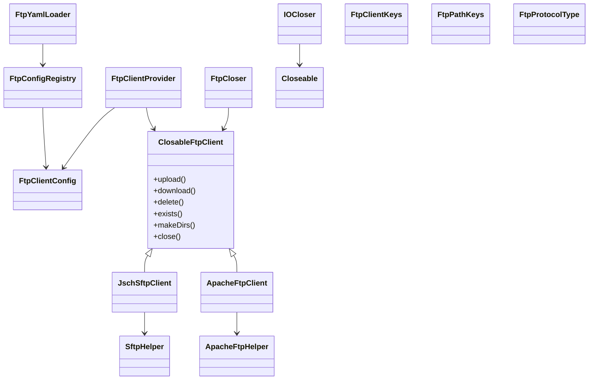
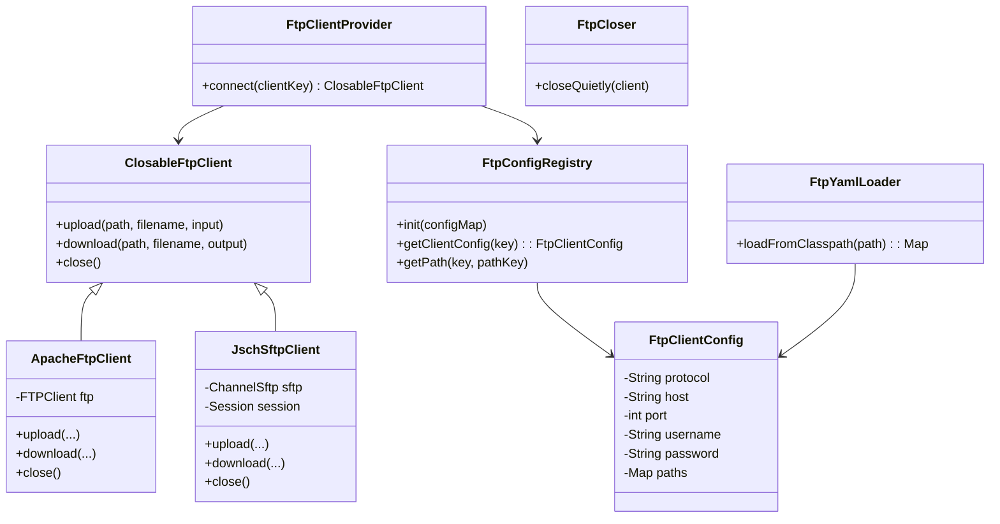
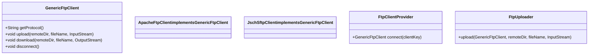

# 目录结构

## 概述

包规划

| 内容                                   | 说明                                   |
| -------------------------------------- | -------------------------------------- |
| 实现类命名统一使用 `xxxClient`         | 如 `ApacheFtpClient`、`JschSftpClient` |
| 协议特有工具类命名统一使用 `xxxHelper` | 如 `FtpHelper`、`SftpHelper`           |
| 工具类私有化构造方法                   | 防止实例化，保持纯静态                 |
| 包内只放本协议相关实现                 | 不要将其他协议类放入非对应目录         |

具体包内容
```text
ftp/
├── client/                   ← FTP 客户端统一接口与实现类（FTP / SFTP）
│   ├── ApacheFtpClient.java
│   ├── ClosableFtpClient.java
│   ├── GenericClosableFtpClient.java
│   └── JschSftpClient.java

├── config/                   ← 配置加载与注册中心
│   ├── FtpClientConfig.java
│   ├── FtpConfigRegistry.java
│   └── FtpYamlLoader.java

├── constant/                 ← 协议枚举、路径 key、client key 常量
│   ├── FtpClientKeys.java
│   ├── FtpPathKeys.java
│   └── FtpProtocolType.java

├── helper/                   ← 操作功能类（上传、下载、文件判断等）
│   ├── ApacheFtpHelper.java
│   └── SftpHelper.java

├── manager/                  ← 连接统一入口与关闭器
│   ├── FtpClientProvider.java
│   └── FtpCloser.java

├── util/                     ← 通用工具类
│   ├── ClassPathResourcesUtils.java
│   └── IOCloser.java

└── Main.java                 ← 示例入口
```

配置

resources/ftp/ftp-config.yaml

```yaml
resources
├── app_dev.properties
├── app_prod.properties
├── ftp
│   ├── ftp-config.yaml
│   └── test
│       └── local.txt
├── ftp.properties
```

## 详情/基本说明

```text
ftp/
├── config/           ← 负责读取与管理 FTP 配置（来源于 YAML）
│   ├── FtpYamlLoader.java         → 从类路径加载并解析 YAML 配置
│   ├── FtpClientConfig.java       → 表示单个 FTP/SFTP 客户端的配置结构
│   └── FtpConfigRegistry.java     → 注册并提供全局访问接口（基于 clientKey）
│
├── provider/         ← 客户端连接创建入口
│   └── FtpClientProvider.java     → 根据 clientKey 和 protocol 连接并创建 FTP/SFTP 客户端
│
├── client/           ← FTP 客户端抽象与实现（未显示但已约定存在）
│   ├── ClosableFtpClient.java     → 通用接口：支持 upload、download、close 等统一操作
│   ├── ApacheFtpClient.java       → FTP 协议具体实现（基于 Apache Commons Net）
│   └── JschSftpClient.java        → SFTP 协议具体实现（基于 JSch）
│
├── utils/
│   └── closer/        ← 辅助关闭连接或流的工具
│       └── FtpCloser.java         → 支持 FTPClient / ChannelSftp 安全关闭
```

## 详情/多客户端支持及后续扩展

```java
├── client // 多客户端支持及后续扩展
│   ├── base // 统一抽象类; 抽象类/接口，定义统一行为
│   │   └── GenericClosableFtpClient.java
│   ├── ftp // ftp客户端, 及功能实现; 所有与 FTP 协议相关的实现、工具、扩展逻辑
│   │   ├── ApacheFtpClient.java
│   │   └── FtpHelper.java
│   ├── oss // 阿里oss客户端及实现
│   │   ├── AliyunOssClientAliyunOssClient.java
│   │   └── OssHelper.java
│   ├── s3 // 亚马逊s3客户端及工具类实现
│   │   ├── AmazonS3Client.java
│   │   └── S3Helper.java
│   └── sftp // ftp客户端, 及功能实现; 所有与 SFTP 协议相关的实现、工具、扩展逻辑
│       ├── JschSftpClient.java
│       └── SftpHelper.java

```


# 角色及关系

架构角色及职责划分

| 角色/组件          | 类名                | 职责说明                                                     |
| ------------------ | ------------------- | ------------------------------------------------------------ |
| **配置加载器**     | `FtpYamlLoader`     | 从 classpath 加载 `yaml` 文件并反序列化为配置对象            |
| **配置注册中心**   | `FtpConfigRegistry` | 将所有 clientKey 映射到 `FtpClientConfig`，并提供路径、host 查询 |
| **配置结构类**     | `FtpClientConfig`   | 封装主机、账号、密码、路径等基本信息                         |
| **连接提供器**     | `FtpClientProvider` | 根据协议动态构建并返回 `ClosableFtpClient` 实例              |
| **统一客户端接口** | `ClosableFtpClient` | 定义上传、下载、关闭等方法接口，支持 try-with-resource       |
| **FTP 实现类**     | `ApacheFtpClient`   | 适配 `org.apache.commons.net.ftp.FTPClient`                  |
| **SFTP 实现类**    | `JschSftpClient`    | 适配 `com.jcraft.jsch.ChannelSftp`                           |
| **连接关闭工具类** | `FtpCloser`         | 统一关闭连接，支持 FTP 与 SFTP                               |

关系



## 其二



and

### Mermaid 架构类图（FTP 工具体系）

以下类图展示了 FTP 工具模块中核心类的结构、继承关系与职责划分：


------

### 关键类内容简要说明

#### 1. `ClosableFtpClient`

- 抽象接口，屏蔽 FTP / SFTP 差异
- 支持 try-with-resources 自动关闭
- 定义通用操作：上传、下载、关闭

#### 2. `ApacheFtpClient`

- 封装 `FTPClient`
- 支持二进制文件上传、下载
- 设置被动模式、防止端口阻塞

#### 3. `JschSftpClient`

- 封装 `ChannelSftp` 与 `Session`
- 使用 `JSch` 实现 SFTP 会话建立与操作

#### 4. `FtpClientProvider`

- 工厂类，根据 `clientKey` 和协议选择创建 FTP 或 SFTP 实例

#### 5. `FtpYamlLoader`

- 加载类路径下 `.yml` 配置文件
- 使用 Jackson / SnakeYAML 解析为 `Map<String, FtpClientConfig>`

#### 6. `FtpConfigRegistry`

- 注册所有配置
- 提供 clientKey → 配置映射、路径查找等能力

#### 7. `FtpCloser`

- 支持 `ClosableFtpClient` 类型安全关闭（可扩展至 SFTP）
- 避免连接泄漏，统一关闭逻辑

------

### 下一步建议

你可根据架构图进一步：

- 补齐测试体系（模拟 FTP/SFTP 测试环境）
- 增加 `exists()`、`mkdir()` 等常用功能
- 抽象 `FtpPathKey`、`FtpClientKey` 常量为 `enum`
- 增加全局连接池（如需复用）或连接生命周期管理器

是否需要我输出一份 `支持功能清单 + 方法入口` 表格？或者生成示例配置和使用文档？

# 功能清单

上传、下载、文件是否存在、目录是否存在

创建文件

创建目录(递归)

重命名

移动

计算文件大小

目录大小 (人可读)

目录文件清单

.....

关闭

- 自动关闭
- 手动关闭(工具类)

| 功能类别   | 支持内容说明                                            |
| ---------- | ------------------------------------------------------- |
| 协议支持   | FTP（Apache Commons）和 SFTP（JSch）                    |
| 客户端连接 | 支持通过 clientKey 获取连接                             |
| 自动关闭   | 所有客户端实现 `AutoCloseable`，支持 try-with-resources |
| 路径管理   | 多路径类型配置（上传、下载等），通过 key 统一管理       |
| 文件操作   | 上传、下载、删除、目录创建、文件是否存在                |
| 配置加载   | 支持从 classpath YAML 加载配置并注册                    |
| 工具封装   | 提供统一的 IOCloser、FtpCloser 工具类                   |
| 枚举与常量 | 协议类型、客户端 key、路径 key 全集中式管理             |

and

| 功能类别     | 描述                                              |
| ------------ | ------------------------------------------------- |
| 配置加载     | 读取 YAML，解析多个 clientKey → config 映射       |
| 配置管理     | 查询配置、获取路径、host、账号、协议等信息        |
| 客户端连接   | 支持 FTP / SFTP 自动创建连接                      |
| 文件上传     | `upload(path, filename, InputStream)`             |
| 文件下载     | `download(path, filename, OutputStream)`          |
| 客户端关闭   | try-with-resources 或手动 `close()`               |
| 安全资源释放 | `FtpCloser` 提供统一关闭方法                      |
| 多协议适配   | 基于 `ClosableFtpClient` 抽象，屏蔽 FTP/SFTP 差异 |
| 流关闭       | IOCloser 工具（补充）支持流安全关闭               |

# 注意事项与建议

1. **工具类 IOCloser 支持完整资源关闭**，设计合理；
2. **Sftp 与 Ftp 工具类分离良好，但调用方仍需判断协议，可考虑抽象进一步解耦**；
3. **推荐封装统一接口（如 FtpClientFactory）暴露 upload/download 等方法，避免业务层感知协议实现差异**；
4. **目前 Main 中的演示代码混杂资源操作与流程逻辑，建议拆分为 SampleService 与 ResourceTest 类解耦职责**；
5. **`FtpClientKeys` 等常量定义清晰合理，体现良好的分层与职责划分**。

| 类别       | 注意点与建议                                           |
| ---------- | ------------------------------------------------------ |
| 配置安全   | 建议密码加密处理或引入配置中心                         |
| 多协议兼容 | 推荐增加 `enum FtpProtocolType`，避免硬编码字符串      |
| 错误处理   | 每个连接过程建议增强异常封装与分类处理                 |
| 流管理     | 所有 `InputStream` / `OutputStream` 强制调用方关闭     |
| 配置隔离   | 不建议将多个 path 配置混在一个 map，可用嵌套结构       |
| 单元测试   | 可考虑使用 `mock-ftp-server`、`embedded-sftp` 模拟测试 |

# 何时加载配置进行初始化? 以及在哪里加载初始化?

## 结论

- 不建议在静态块中加载 YAML
- 应在应用启动阶段, 在应用入口处(mai或初始化入口)中执行一次即可

## 相关代码及问题

```java

Map<String, FtpClientConfig> configMap = FtpYamlLoader.load(yamlFile);         FtpConfigRegistry.init(configMap);   
```

上述代码, 是每次使用时调用，还是使用静态块加载，整个应用中都可使用

## 概述: 是每次使用时调用，还是使用静态块加载，整个应用中都可使用

关于：

```java
Map<String, FtpClientConfig> configMap = FtpYamlLoader.load(yamlFile);
FtpConfigRegistry.init(configMap);
```

这段逻辑建议在应用启动阶段执行一次即可，**不应每次使用 FTP 功能时都重复调用**，也不建议放在静态块中执行，因为静态块无法动态加载外部 YAML 文件路径。

### 推荐方式

在你的 `main` 方法或初始化入口中手动调用：

```java
public class Main {
    public static void main(String[] args) throws IOException {
        String yamlFile = "config/ftp-config.yaml";
        Map<String, FtpClientConfig> configMap = FtpYamlLoader.load(yamlFile);
        FtpConfigRegistry.init(configMap); // 全局注册一次

        // 后续任意位置可直接使用
        FTPClient client = FtpClientProvider.connect("ftpA");
        // ...
    }
}
```

这样做的好处：

- 配置初始化与 FTP 工具解耦，灵活控制时机；
- 加载失败可中断启动，避免后续调用失败；
- 更适用于 CLI 工具、Spring Boot 启动器、独立任务等多种应用结构。

若你希望封装成类库供外部调用，也可以要求调用方显式初始化 `FtpConfigRegistry.init(...)`，保持灵活性和可控性。

## 疑问: 静态块无法动态加载外部 YAML 文件路?

静态块无法动态加载外部 YAML 文件路? 具体指什么

你提到“不太明白静态块无法动态加载外部 YAML 文件路径”的问题，下面给出详细解释：

### 什么是静态块？

静态块（`static { ... }`）是在类加载时就执行的代码块：

```java
public class FtpInitializer {
    static {
        // 此处代码在类第一次被加载时执行
    }
}
```

### 为什么不建议在静态块中加载 YAML？

因为静态块在**类加载阶段就执行**，此时你通常还**拿不到外部配置文件的路径**，例如：

```java
String yamlPath = System.getProperty("configPath"); // 可能为空
```

这会导致以下问题：

1. **路径不确定**：你还没从命令行参数、配置中心、Spring 环境等方式传入路径；
2. **异常难以处理**：静态块中抛出异常无法优雅捕获，会导致类加载失败；
3. **可测性差**：静态块自动执行，不利于写单元测试或做多配置测试；
4. **不可控时机**：你无法控制初始化的顺序，谁先引用该类，配置就加载了，可能还没准备好环境；

### 推荐方式（可控初始化）

将加载逻辑放在 `main()` 或统一入口方法中显式调用：

```java
public class Main {
    public static void main(String[] args) throws IOException {
        String yamlPath = System.getProperty("configPath", "config/ftp-config.yaml");
        Map<String, FtpClientConfig> map = FtpYamlLoader.load(yamlPath);
        FtpConfigRegistry.init(map); // 明确时机、路径、安全
    }
}
```

这样可以做到：

- 路径可配置
- 初始化时机受控
- 异常可捕获
- 便于测试和维护

如果仍希望在类加载时就加载配置，可以使用单例延迟加载 + 明确加载方法，而不是静态块。是否需要提供这样的懒加载封装？

# 多客户端支持, 及扩展

## ftp与sftp客户端是独立封装? 还是统一封装?

ftp的client获取, 以及相关工具类封装,  是ftp与sftp独立封装成两套工具类, 还是将一个工具体系兼容两者

这个问题非常关键，关系到整个工具体系的**设计边界、复用性与扩展性**。

我们从设计维度、项目维护、可扩展性三方面进行系统分析，并做出推荐：

------

### 选项一：**FTP 与 SFTP 分开两套工具类（独立体系）**

#### 特点

- 每种协议对应一套独立 `Uploader`、`Downloader`、`ClientProvider` 等工具类；
- FTP 工具类只依赖 `Apache Commons Net`；
- SFTP 工具类只依赖 `JSch`；

#### 优点

- **职责单一**，每套工具只关心自己协议；
- **依赖分离**，可按需引入，体积小，适合做成独立模块；
- 容错逻辑、错误类型、连接行为可以完全自定义；
- 更适合在 FTP 或 SFTP 只用其一的项目中部署或发布。

#### 缺点

- 重复逻辑（如路径解析、异常封装、通用参数）较多；
- 上层业务调用需判断协议或手动调用不同工具类；
- 如果未来支持更多协议（如 S3、OSS），会变成多套体系并行，维护压力上升。

------

### 选项二：**统一一套工具体系，兼容 FTP + SFTP（推荐）**

#### 特点

- 定义统一接口（如 `GenericFtpClient`、`IFtpUploader`）；
- 不同协议底层实现抽象为适配器（FTPClient / ChannelSftp）；
- `FtpClientProvider` 返回统一包装类 `GenericFtpClient`；
- 工具类如 `FtpUploader.upload(GenericFtpClient client, ...)` 统一处理。

#### 优点

- 调用方完全不关心协议：一次封装，多协议兼容；
- 更利于复用与集成：Controller、定时任务只维护一套逻辑；
- 未来扩展方便：只需新增 `AliyunOssClient implements GenericFtpClient`；
- 业务逻辑更简洁：框架层隔离协议分支，调用一致性好。

#### 缺点

- 初期封装略复杂，需考虑接口设计；
- 统一接口可能牺牲部分协议细节控制；
- 单一项目中只使用一种协议时，引入另一个协议的依赖略显冗余（可分模块打包解决）；

------

### 推荐结论

#### 默认推荐：统一封装，兼容两者

适用于：

- 项目需同时支持 FTP 与 SFTP；
- 期望上层调用逻辑统一；
- 希望后续扩展到 OSS、WebDAV、S3 等更多协议；
- 有较强封装与架构抽象能力的团队；

#### 特殊情况使用分离封装：

- 如果项目中确定 **永远只用 FTP 或 SFTP 一种**；
- 希望减少依赖体积；
- 使用者能力偏初级，期望结构更简单明确；

------

### 类结构建议（统一封装）



------

### 总结建议

| 场景                      | 建议                   |
| ------------------------- | ---------------------- |
| 需要 FTP + SFTP           | 统一封装               |
| 仅用 FTP 或仅用 SFTP      | 可独立封装（轻依赖）   |
| 未来扩展 OSS/S3/WebDAV 等 | 强烈建议统一接口封装   |
| 团队偏向明确职责          | 独立工具类更易理解维护 |

------

是否需要我提供一套完整的 `GenericFtpClient` 工具体系模板（含上传、下载、路径管理、连接管理、异常封装等）？你可直接集成使用。

## ftp, sftp及其他客户端, 功能是否需要独立封装? 

如果要实现判断文件是否存在, 目录是否存在, 上传, 下载, 两个客户端都要进行分别实现

是的，如果你希望实现如：

- 判断远程文件是否存在；
- 判断目录是否存在或自动创建；
- 上传文件；
- 下载文件；

那么在你当前的**统一封装结构（FTP + SFTP 兼容）**下，需要在 FTP 与 SFTP 的实现类中分别实现这些功能，原因如下：

------

### 一、FTP 和 SFTP 协议的根本差异

| 功能             | FTPClient（FTP）                 | ChannelSftp（SFTP）           |
| ---------------- | -------------------------------- | ----------------------------- |
| 判断文件是否存在 | 只能通过 `listFiles()` 模拟查找  | 支持 `stat(path)`，可直接判断 |
| 判断目录是否存在 | 同上，需遍历列表查找目录名       | `stat(path).isDir()` 更直接   |
| 创建目录         | `makeDirectory(path)`            | `mkdir(path)`                 |
| 上传文件         | `storeFile(fileName, input)`     | `put(input, fileName)`        |
| 下载文件         | `retrieveFile(fileName, output)` | `get(fileName, output)`       |

> 因为**两种协议底层命令完全不同**，API 实现方式不同，所以你必须在各自的实现类中分别处理。

------

### 二、设计方式建议

你当前统一接口为 `ClosableFtpClient`，我们建议在此基础上扩展方法，并在两个子类中分别实现。

------

### 三、抽象类扩展方法定义

```java
public abstract class ClosableFtpClient implements AutoCloseable {
    public abstract String getProtocol();

    public abstract void upload(String remoteDir, String fileName, InputStream input) throws Exception;

    public abstract void download(String remoteDir, String fileName, OutputStream output) throws Exception;

    public abstract boolean fileExists(String remoteDir, String fileName) throws Exception;

    public abstract boolean directoryExists(String remoteDir) throws Exception;

    public abstract void createDirectory(String remoteDir) throws Exception;

    protected abstract void disconnect();

    @Override
    public final void close() {
        disconnect();
    }
}
```

------

### 四、FTP 实现类示例（ApacheFtpClient）

```java
public boolean fileExists(String remoteDir, String fileName) throws IOException {
    ftp.changeWorkingDirectory(remoteDir);
    FTPFile[] files = ftp.listFiles(fileName);
    return files != null && files.length > 0;
}

public boolean directoryExists(String remoteDir) throws IOException {
    return ftp.changeWorkingDirectory(remoteDir);
}

public void createDirectory(String remoteDir) throws IOException {
    ftp.makeDirectory(remoteDir);
}
```

------

### 五、SFTP 实现类示例（JschSftpClient）

```java
public boolean fileExists(String remoteDir, String fileName) {
    try {
        SftpATTRS attrs = sftp.stat(remoteDir + "/" + fileName);
        return !attrs.isDir();
    } catch (SftpException e) {
        return false;
    }
}

public boolean directoryExists(String remoteDir) {
    try {
        SftpATTRS attrs = sftp.stat(remoteDir);
        return attrs.isDir();
    } catch (SftpException e) {
        return false;
    }
}

public void createDirectory(String remoteDir) throws SftpException {
    sftp.mkdir(remoteDir);
}
```

------

### 六、统一调用方式（对调用方透明）

```java
try (ClosableFtpClient client = FtpClientProvider.connect("ftpA")) {
    if (!client.directoryExists("/upload")) {
        client.createDirectory("/upload");
    }
    if (!client.fileExists("/upload", "a.txt")) {
        client.upload("/upload", "a.txt", new FileInputStream("a.txt"));
    }
}
```

------

### 七、总结

| 内容                     | 说明                                           |
| ------------------------ | ---------------------------------------------- |
| 是否要分别实现           | 是，必须分别实现                               |
| 推荐封装方式             | 定义抽象类统一接口，各协议具体类分别实现       |
| 是否需要手动判断路径类型 | 是，FTP 无法直接判断目录，只能模拟             |
| 是否建议提供通用工具类   | 是，例如封装 `ensureDirectoryExists(...)` 工具 |

------

是否需要我封装一个 `FtpFileHelper` 工具类（接受 `ClosableFtpClient`，实现常用文件判断、创建目录、递归上传）？

## 多客户端支持及后续扩展

目录结构

```java

$ tree ..           
..
├── client // 多客户端支持及后续扩展
│   ├── base // 统一抽象类
│   │   └── GenericClosableFtpClient.java
│   ├── ftp // ftp客户端, 及功能实现
│   │   ├── ApacheFtpClient.java
│   │   └── FtpHelper.java
│   ├── oss // 阿里oss客户端及实现
│   │   ├── AliyunOssClientAliyunOssClient.java
│   │   └── OssHelper.java
│   ├── s3 // 亚马逊s3客户端及工具类实现
│   │   ├── AmazonS3Client.java
│   │   └── S3Helper.java
│   └── sftp // ftp客户端, 及功能实现
│       ├── JschSftpClient.java
│       └── SftpHelper.java

```


# 如何处理异常? 

## 结论

- 不要吞异常, 向上抛出. 
- 除非特殊情况, 不抛, 自己处理
  - 自己处理, 一般叫做 `xxxQuietly` , 安静处理, 系统或请求无需停止
  - 比如, 已经在controller层, 或其他顶层, 自己处理错误(打印信息及堆栈等), 统一封装返回格式(正确的, 错误的:错误原因等)
  - 文件处理, 如清理某个不用的文件, io失败等, 可以不抛. 打印提示信息及堆栈即可. 
  - ...

一下是自己处理(安静)示例

```java
public class FtpService {
    private final FtpClientManager manager;

    public FtpService(FtpClientManager manager) {
        this.manager = manager;
    }

    public void upload(String ftpName, String path, InputStream inputStream, String fileName) throws IOException {
        FTPClient client = null;
        try {
            client = manager.getClient(ftpName);
            client.changeWorkingDirectory(path);
            client.storeFile(fileName, inputStream);
        } finally {
            closeQuietly(client);
        }
    }

    private void closeQuietly(FTPClient client) {
        if (client != null && client.isConnected()) {
            try {
                client.logout();
            } catch (IOException ignored) {
            }
            try {
                client.disconnect();
            } catch (IOException ignored) {
            }
        }
    }
}

```

## 问题/工具类中吞异常, 出了问题无法排查

ftp问题之一, 工具类中吞异常, 出了问题无法排查. 各种场景说明, 及方案

这是一个极其常见且严重的设计问题：

> **问题现象**：FTP 工具类内部出现异常（如上传失败、目录创建失败、连接异常），却被 try-catch 吞掉，导致：
>
> - 调用方毫无感知
> - 日志不完整或无关键堆栈信息
> - 整体业务逻辑表现为“什么都没发生”，严重影响排查与维护

### 一、典型错误代码示例

```java
public static void upload(FTPClient ftpClient, String path, InputStream input) {
    try {
        ftpClient.storeFile(path, input);
    } catch (IOException e) {
        // 被吞掉了，什么也不做或仅仅打印(e.printstack)
    }
}
```

调用方：

```java
ftpUploader.upload(ftpClient, "/abc/a.txt", stream); // 调用后一切“正常”，但其实什么也没上传
```


以下是针对 FTP 工具类中**异常被吞**的典型错误代码场景进行全面穷举与分析，涵盖上传、下载、目录、连接、编码、资源释放等多个方面。

------

### 一、异常被吞的典型场景分类与错误示例

| 类别         | 操作                        | 错误示例                                                     | 可能后果                                         |
| ------------ | --------------------------- | ------------------------------------------------------------ | ------------------------------------------------ |
| **连接阶段** | 连接失败                    | `ftpClient.connect(host);` → 异常被吞                        | 无法连接，调用方误以为连接成功                   |
|              | 登录失败                    | `ftpClient.login(user, pass);` → 异常被吞                    | 登录失败后继续操作，抛出更多异常                 |
|              | 设置模式失败                | `ftpClient.enterLocalPassiveMode();` → 异常被吞              | 数据通道建立失败，导致文件操作挂起或中断         |
|              | 设置编码失败                | `ftpClient.setControlEncoding("UTF-8");` → 异常被吞          | 中文路径乱码                                     |
| **上传阶段** | 上传失败                    | `ftpClient.storeFile(path, input);` → 返回 false 或抛异常被吞 | 文件未上传，业务逻辑继续，出现“空结果”或“假成功” |
|              | 重复上传                    | 文件覆盖、权限不足 → 异常被吞                                | 调用方误以为覆盖成功，实际无变化                 |
| **下载阶段** | 获取输入流失败              | `ftpClient.retrieveFileStream(path);` → 异常被吞             | 得到 null，操作 NPE                              |
|              | 下载失败                    | `ftpClient.retrieveFile(...)` → 返回 false 被忽略            | 文件未下载，业务继续执行错误逻辑                 |
| **目录操作** | 创建目录失败                | `ftpClient.makeDirectory(path);` → 异常被吞                  | 上传目标路径不存在                               |
|              | 切换目录失败                | `ftpClient.changeWorkingDirectory(path);` → false 被吞       | 接下来所有操作均在错误目录下进行                 |
|              | 删除目录失败                | `ftpClient.removeDirectory(path);` → 异常被吞                | 清理逻辑不完整，造成遗留数据                     |
| **文件操作** | 删除文件失败                | `ftpClient.deleteFile(filePath);` → false 被吞               | 文件未删，误认为已处理                           |
|              | 判断文件存在失败            | `ftpClient.listFiles(path);` → IOException 被吞              | 文件存在判断错误，后续操作异常                   |
| **连接关闭** | 登出失败                    | `ftpClient.logout();` → 异常被吞                             | 连接未正常释放，连接池泄漏风险                   |
|              | 断开失败                    | `ftpClient.disconnect();` → 异常被吞                         | 网络连接残留，资源未释放                         |
| **异常处理** | 所有异常统一 try-catch 忽略 | `catch (IOException e) {}`                                   | 系统日志缺失，业务层误判为成功                   |

------

### 二、易被误判为“正常成功”的危险调用

| 场景       | 问题代码                                     | 表面返回成功，但实则失败                        |
| ---------- | -------------------------------------------- | ----------------------------------------------- |
| 文件上传   | `ftpClient.storeFile()` → false 被忽略       | 文件未写入，返回 true 才表示成功                |
| 下载流获取 | `retrieveFileStream()` 返回 null             | 若未判断或未捕获异常，导致 NullPointerException |
| 删除文件   | `deleteFile()` 返回 false 被忽略             | 文件依旧存在，逻辑未生效                        |
| 切换目录   | `changeWorkingDirectory()` 返回 false 被忽略 | 文件上传到了错误路径                            |

------

### 三、统一规范：哪些异常必须抛、哪些可记录

| 类型                     | 是否应抛出 | 建议处理方式                       |
| ------------------------ | ---------- | ---------------------------------- |
| 连接类（connect、login） | 是         | 明确抛出，标记为初始化失败         |
| 上传、下载类             | 是         | 抛出 `FtpException` 或返回结果封装 |
| 路径、目录类             | 是         | 明确记录日志 + 抛异常              |
| 编码设置                 | 否         | 记录日志即可（不影响连接）         |
| 登出、断开类             | 否         | `finally` 中记录日志，不抛出       |
| 日志用途的文件遍历       | 否         | 可以吞掉但记录日志                 |

------

### 四、总结：Ftp 工具类中所有需要处理的调用项（必须异常安全）

| 功能分类     | 关键方法                                       | 建议处理方式                        |
| ------------ | ---------------------------------------------- | ----------------------------------- |
| 连接         | connect、login                                 | 明确抛出                            |
| 模式设置     | enterPassiveMode、setFileType                  | 记录失败                            |
| 路径切换     | changeWorkingDirectory、makeDirectory          | 抛出或返回封装结果                  |
| 文件操作     | storeFile、retrieveFile、deleteFile、listFiles | 抛出异常或包装成 Result             |
| 关闭连接     | logout、disconnect                             | try-catch 但需记录日志              |
| 判断是否成功 | 返回 boolean 的方法                            | 必须判断是否为 true，false 视为失败 |
| 获取流       | retrieveFileStream、getInputStream             | 判空 + 异常捕获                     |

------

### 五、推荐模板代码结构（上传为例）

```java
public static void uploadFile(FTPClient ftpClient, String remotePath, InputStream input) {
    try {
        if (!ftpClient.changeWorkingDirectory(remotePath)) {
            throw new FtpException("切换目录失败：" + remotePath);
        }

        boolean success = ftpClient.storeFile("file.txt", input);
        if (!success) {
            throw new FtpException("上传失败：storeFile 返回 false");
        }
    } catch (IOException e) {
        throw new FtpException("FTP上传异常：" + e.getMessage(), e);
    }
}
```

------

### 六、小结与建议

| 问题                    | 原因                         | 建议                                    |
| ----------------------- | ---------------------------- | --------------------------------------- |
| 工具类吞异常            | 过度 try-catch 不抛出        | 明确职责，工具类记录 + 抛出             |
| 无日志                  | 没有堆栈、无定位手段         | 所有 `catch` 均需日志堆栈输出           |
| 返回值 false 未处理     | 不检查 storeFile、deleteFile | 必须检查 boolean 返回值，false 视为异常 |
| finally 中 swallow 错误 | 资源释放时忽略 logout 异常   | 可吞但必须日志，不能 silence            |

如你需要，我可提供一份完整的 FTP 工具类安全模板，支持：

- 所有操作异常封装成 `FtpException`
- 返回值检测
- 自动日志记录
- 提供 `Result<T>` 包装形式调用可选返回

是否继续？

## 二、可能出现的场景与后果

| 场景         | 问题说明                           | 后果                       |
| ------------ | ---------------------------------- | -------------------------- |
| 上传失败     | 文件权限 / 目录不存在 / 文件名非法 | 文件未上传，调用方毫无知觉 |
| 创建目录失败 | 权限不足或目录已存在异常           | 后续上传失败，但异常被吞   |
| 被动模式失败 | 网络中断 / FTP服务器设置不一致     | 操作失败但不抛出           |
| 登出失败     | `logout()` 异常吞掉                | 没及时释放资源，连接泄漏   |

## 三、正确的异常处理策略

#### 方案一：对调用方显性抛出异常（推荐）

```java
public static void upload(FTPClient ftpClient, String path, InputStream input) {
    try {
        boolean success = ftpClient.storeFile(path, input);
        if (!success) {
            throw new IOException("FTP storeFile returned false for path: " + path);
        }
    } catch (IOException e) {
        throw new RuntimeException("FTP upload failed: " + e.getMessage(), e);
    }
}
```

调用方感知失败：

```java
try {
    ftpUploader.upload(ftpClient, "/a/b.txt", stream);
} catch (RuntimeException e) {
    log.error("上传失败: ", e);
}
```

#### 好处：

- 异常堆栈完整
- 可由调用方统一处理、记录、回滚或告警

------

#### 方案二：异常转换 + 返回结果对象

```java
public class FtpResult {
    private boolean success;
    private String message;
    private Exception exception;
    // 构造器 / getter
}
public static FtpResult upload(FTPClient ftpClient, String path, InputStream input) {
    try {
        boolean success = ftpClient.storeFile(path, input);
        if (!success) {
            return new FtpResult(false, "上传失败", null);
        }
        return new FtpResult(true, "上传成功", null);
    } catch (IOException e) {
        return new FtpResult(false, "异常: " + e.getMessage(), e);
    }
}
```

调用方：

```java
FtpResult result = ftpUploader.upload(...);
if (!result.isSuccess()) {
    log.error("FTP上传失败: {}", result.getMessage(), result.getException());
}
```

------

#### 方案三：记录日志 + 重新抛出

```java
try {
    ftpClient.makeDirectory(path);
} catch (IOException e) {
    log.error("创建目录失败 path: {}", path, e);
    throw new FtpException("创建目录失败", e);
}
```

- 保证异常链不丢失
- 提供业务语义更清晰的异常（如 `FtpException`）

## 四、统一封装建议

#### 1. 定义异常类（如 `FtpException`）

```java
public class FtpException extends RuntimeException {
    public FtpException(String message, Throwable cause) {
        super(message, cause);
    }
}
```

#### 2. 工具类中永远不应吞异常

- 要么记录日志 + 抛出
- 要么封装错误结果返回

#### 3. 接口设计上保持异常透明

- 不要内部 try-catch 后 `return false` 或什么也不做
- 让调用方知道失败，做出响应（如重试、记录、提示用户）

## 五、小结

| 设计问题             | 建议方案                            |
| -------------------- | ----------------------------------- |
| 异常被吞             | 明确记录日志，保留堆栈              |
| 工具方法中 try-catch | 只处理 `finally` 或包装异常重新抛出 |
| 业务不可恢复异常     | 立即抛出，交由上层捕获              |
| 可恢复异常           | 捕获后记录 + 封装结果返回           |

## 六、补充建议：区分“资源释放异常”与“业务失败异常”

```java
try {
    ftpUploader.upload(...);
} catch (FtpException e) {
    log.error("上传失败: {}", e.getMessage(), e);
} finally {
    FtpUtils.closeQuietly(ftpClient); // 释放异常可吞，但必须保证连接断开
}
```

如你希望，我可以提供一份完整的 `FtpUploader` 模板类，封装好连接创建、异常处理、日志记录、资源关闭等职责，适用于中大型系统的统一封装方案。

###### 

# 如何关闭资源

## 问题: 对于ftpclient(connction), 多次使用后统一关闭? 还是即用即关, 再使用再获取链接

是统一维护client，中间各个过程都是用该client，最后关闭？ 还是使用完就关闭，再次使用时，再次获取client

这是一个**关键设计决策点**，影响系统性能、复杂度与安全性。

我们分两种策略进行分析，并明确推荐：

### 结论

- 使用完即关; 再次使用再次获取链接
- 工具类中, 只完成业务, 禁止关闭连接;
  - 比如, upload、download等, 只负责功能业务; upload或download之后的关闭, 单独处理
- 如何关闭
  - 手动调用(封装关闭工具类. 
    - 如接口com.st.modules.file.ftp.client.base.GenericClosableFtpClient#disconnect关闭方法, 以及各子类的具体实现
    - 如com.st.modules.io.closer.IOCloser各种关闭io的方法
  - try with resource. 实现了autocloseable接口

### 策略一：使用完即关（推荐，除非有强需求连接复用）

#### 描述

每次使用 `FtpClientProvider.connect(...)` 获取一个新的 `FTPClient`，操作完成后立即关闭连接。

#### 优点

- 实现简单，线程安全；
- 没有连接泄露、空连接等风险；
- 不需要连接池或生命周期管理；
- 一致性强，最适合**单次上传/下载的调用模型**（如定时任务、Controller 中操作、异步任务等）；

#### 缺点

- 每次操作都会创建/销毁 socket 连接，性能较低；
- 不适合高频调用或批量上传下载。

#### 典型流程

```java
FTPClient client = FtpClientProvider.connect("ftpA");
String path = FtpPathResolver.resolve("ftpA", "upload");
FtpUploader.upload(client, path, "demo.txt", new FileInputStream("demo.txt"));
// 工具内部已关闭 client
```

------

### 策略二：client 复用（延迟关闭）

#### 描述

调用方手动控制连接关闭，允许在整个业务流程中复用 `FTPClient`。

#### 优点

- 性能更高，连接复用，避免频繁握手；
- 适用于多个上传/下载连续操作的批处理流程；

#### 缺点

- 必须由调用者控制关闭，否则连接泄露；
- `FTPClient` 非线程安全，不能跨线程使用；
- 出现异常时更难保障资源释放；
- 如无连接池封装（Apache Commons Pool 等），扩展复杂；

#### 示例

```java
FTPClient client = FtpClientProvider.connect("ftpA");
try {
    String path1 = FtpPathResolver.resolve("ftpA", "upload");
    FtpUploader.upload(client, path1, "1.txt", new FileInputStream("1.txt"));

    String path2 = FtpPathResolver.resolve("ftpA", "backup");
    FtpUploader.upload(client, path2, "2.txt", new FileInputStream("2.txt"));

} finally {
    FtpCloser.closeQuietly(client);
}
```

------

### 推荐策略：默认使用“使用完即关”策略

原因如下：

1. 对于 80% 的实际场景（定时任务、Controller 一次性请求等），都是**短连接模型**；
2. 不易出错：不需用户显式维护连接生命周期；
3. 可根据业务场景**选择性开放复用**重载方法，例如：

```java
// 不负责关闭（需调用方控制）
public static void uploadWithoutClose(FTPClient client, String path, String fileName, InputStream input);
```

------

### 扩展建议

若确实需要复用连接，可进一步：

- 引入连接池（如 Apache Commons Pool）封装 FTPClient；
- 提供 `FtpClientPoolManager.borrow(...) / return(...)` 接口；
- 管理连接可用性、健康检查、线程隔离；

但这属于高级场景，不建议在通用工具类中默认支持。

------

### 总结建议

| 场景类型              | 推荐策略              |
| --------------------- | --------------------- |
| 单次请求 / 控制器上传 | 使用完即关            |
| 定时任务 / 批处理任务 | 可选择复用连接        |
| 多线程并发上传下载    | 使用完即关 + 线程池   |
| 高性能需求            | 引入连接池 + 健康检查 |

如需提供复用连接池样例、或配置驱动方式选择策略（例如从 YAML 控制是否复用），可继续提供。是否需要？

# 如何关闭资源/真实错误案例/多处使用ftp, 但中间被关闭,导致后续ftp无法使用, 导致异常

## 最终结论

- 还是按上面结论, 即用即关, 而不是像下面分析的在controller、service等处, 统一关闭

## 现象

如, controller, service中多处使用ftpclient, 而中间的某个步骤, 如上传、创建目录等功能中处理完会关闭connect, 导致下面的步骤中使用ftpclient没有连接. 说明该问题, 以及对应的解决方案

## 分析及方案

确实，`FTPClient` 的关闭处理若不规范，很容易导致以下问题：

> **问题现象**：
> 多个组件（如 Controller、Service、Util 等）共用同一个 `FTPClient` 实例，在其中某一步调用了 `closeQuietly(ftpClient)`，导致连接断开，后续操作抛出 `FTPConnectionClosedException` 或无效连接异常。

------

### 一、问题本质说明

#### **代码示例**

```java
ftpClient.makeDirectory("/newDir"); // 内部创建后 closeQuietly(ftpClient)
ftpClient.storeFile("/newDir/file.txt", inputStream); // 报错：连接已关闭
```

#### **问题本质**

- `ftpClient` 是有状态连接对象，`disconnect()` 一旦调用，**连接不可复用**
- 连接关闭应该是**由统一上下文或调用者负责的事情**
- 中间层工具类如 `FtpUtil.upload()` 不应私自关闭连接，否则破坏调用方逻辑控制

------

### 二、常见错误模式

| 错误模式                              | 问题说明                                 |
| ------------------------------------- | ---------------------------------------- |
| 工具方法中调用 `closeQuietly()`       | 把连接生命周期限制在方法内部，破坏调用链 |
| 多层调用但未声明连接归属权            | 上层以为连接仍可用，实则已断开           |
| 靠 `ftpClient.isConnected()` 判断复用 | 连接一旦关闭，无法恢复，只能重新创建     |

------

### 三、推荐的解决方案

#### 方案一：连接生命周期由调用方管理（最推荐）

- 工具类只处理上传、下载，不做连接关闭
- 所有 `ftpClient.logout()` / `disconnect()` 放在 controller/service 统一关闭处

##### 示例：

```java
public void handleUpload() {
    FTPClient ftpClient = ftpConnectionFactory.create(); // 创建连接
    try {
        ftpUploader.createDirectory(ftpClient, "/abc");
        ftpUploader.upload(ftpClient, "/abc/a.txt", fileStream);
    } finally {
        FtpUtils.closeQuietly(ftpClient); // 只在最后关闭连接
    }
}
```

工具类内部不要调用 `closeQuietly()`

------

#### 方案二：封装上下文（如 `FtpSession`）

封装连接 + 统一生命周期管理：

```java
public class FtpSession implements Closeable {
    private final FTPClient ftpClient;

    public FtpSession() {
        this.ftpClient = ftpConnectionFactory.create();
    }

    public void upload(...) {
        // 上传逻辑
    }

    @Override
    public void close() {
        FtpUtils.closeQuietly(ftpClient);
    }
}
```

使用方式：

```java
try (FtpSession session = new FtpSession()) {
    session.upload(...);
    session.createDir(...);
}
```

- 生命周期明确，`close()` 自动关闭
- 多操作共享连接，不提前断开

------

#### 方案三：使用连接池（如 Apache Commons Pool + FTPClient）

- 不常用，但适用于高并发场景
- 需要自行实现连接回收、健康检查

------

### 四、小结与建议

| 问题                   | 建议                                                |
| ---------------------- | --------------------------------------------------- |
| 多步操作中连接提前关闭 | 严禁工具类中调用 `disconnect()`                     |
| 谁应关闭连接？         | 连接创建方应负责关闭（如 controller、service）      |
| 如何封装生命周期？     | 可用 try-with-resources + 包装类（如 `FtpSession`） |

------

### 五、推荐结构归纳

```java
Controller/Service
    └─ 创建并管理 FTPClient 生命周期
        └─ 工具类只处理逻辑（上传/下载/建目录）
            └─ 工具类不得关闭连接
```

如你需要，我可以补充完整封装方案，包括：

- FTP连接工厂类
- FtpSession 管理类
- 工具方法标准模板（不负责关闭）

## try(){} 与try {}语法区别

在 Java 中：

```java
try () { ... }
```

和

```java
try { ... }
```

是两种**完全不同用途的语法结构**，本质区别在于：

------

### 一、`try {}`：传统 `try-catch-finally` 块

#### 语法形式

```java
try {
    // 可能抛出异常的代码
} catch (Exception e) {
    // 异常处理逻辑
} finally {
    // 最终执行（可选）
}
```

#### 用途

- 捕获并处理运行时异常；
- 与 `catch` / `finally` 配合，用于异常控制流程；
- **不具备自动关闭资源能力**，资源（如 `InputStream`、连接）需手动 `close()`。

------

### 二、`try (资源) {}`：`try-with-resources` 自动关闭语法（Java 7+）

#### 语法形式

```java
try (ResourceType resource = new ResourceType()) {
    // 使用资源
}
```

也可以多个资源：

```java
try (
    InputStream in = new FileInputStream("a.txt");
    OutputStream out = new FileOutputStream("b.txt")
) {
    // 使用 in, out
}
```

#### 要求

- 资源类型必须实现 `AutoCloseable` 接口（如 `InputStream`、`Connection`、你自定义的 `ClosableFtpClient`）；
- `try` 结束后会自动调用每个资源的 `close()` 方法，**无需显式 finally 手动关闭**；
- 资源的关闭顺序是**从后到前（反向）**。

------

### 三、对比总结

| 特性             | `try {}`                            | `try (资源) {}`（try-with-resources）        |
| ---------------- | ----------------------------------- | -------------------------------------------- |
| 最低支持版本     | 所有 Java 版本                      | Java 7 及以上                                |
| 是否自动关闭资源 | 否                                  | 是（必须实现 AutoCloseable）                 |
| 是否用于异常处理 | 是（必须搭配 `catch` 或 `finally`） | 是（可以有，也可以没有 catch）               |
| 是否可以声明资源 | 否                                  | 是（在 `()` 中声明）                         |
| 推荐场景         | 一般异常处理逻辑                    | 文件流、网络连接、数据库连接等资源性对象处理 |

------

### 四、最佳实践建议

| 场景                      | 推荐写法                               |
| ------------------------- | -------------------------------------- |
| 打开文件、Socket、FTP连接 | `try-with-resources`（可防止资源泄露） |
| 普通异常处理              | 使用传统 `try-catch`                   |

------

### 五、组合写法（try-with-resources + catch）

```java
try (InputStream in = new FileInputStream("a.txt")) {
    // 正常逻辑
} catch (IOException e) {
    // 异常处理
}
```

------

如需我演示 `try-with-resources` 的执行顺序、底层原理（如编译后代码）、或与 Spring 中资源管理的对比，请继续提出。

## 关闭方式, 及示例

- 手动关闭
- try with resource关闭
- com.st.modules.file.ftp.main.Main

```java
package com.st.modules.file.ftp.main;

import com.st.modules.file.classpath.ClassPathResourcesUtils;
import com.st.modules.file.ftp.client.base.GenericClosableFtpClient;
import com.st.modules.file.ftp.config.FtpClientConfig;
import com.st.modules.file.ftp.config.FtpConfigRegistry;
import com.st.modules.file.ftp.config.FtpYamlLoader;
import com.st.modules.file.ftp.constant.constant.FilePathConst;
import com.st.modules.file.ftp.constant.constant.FtpClientKeys;
import com.st.modules.file.ftp.constant.constant.FtpPathKeys;
import com.st.modules.file.ftp.provider.FtpClientProvider;
import com.st.modules.file.ftp.utils.closer.FtpCloser;
import com.st.modules.io.closer.IOCloser;
import lombok.SneakyThrows;

import java.io.*;
import java.util.Map;

public class Main {

    /**
     * 测试基本用法.
     *
     * <p></p>
     * 关闭资源(IO, ftp连接等)方式
     * <pre>
     *  - 手动关闭
     *  - try with resouce 关闭
     * </pre>
     * @param args
     * @throws IOException
     */
    @SneakyThrows
    public static void main(String[] args) throws IOException {
        Map<String, FtpClientConfig> configs = FtpYamlLoader.loadFromClasspath(FilePathConst.FTP_CONFIG_PATH_DEV);
        FtpConfigRegistry.init(configs);

        //test case: 自动关闭 try with resource自动关闭
        useWithTry(FtpClientKeys.FTP_A, FtpPathKeys.UPLOAD);
        //test case: 手动关闭
        useWithManualClose(FtpClientKeys.FTP_A, FtpPathKeys.UPLOAD);
    }

    /**
     * <pre>
     *  - 使用try with resources 关闭
     * </pre>
     * @param clientKey
     * @param pathKey
     * @throws IOException
     */
    @SneakyThrows
    private static void useWithTry(String clientKey, String pathKey) throws IOException {
        String path = FtpConfigRegistry.getPath(clientKey, pathKey);

        // 使用try with resources 关闭
        try (
                GenericClosableFtpClient client = FtpClientProvider.connect(clientKey);
                InputStream input = ClassPathResourcesUtils.getClasspathFile("ftp/test/local.txt");
                OutputStream output = new FileOutputStream("copy-try.txt")
        ) {
            client.upload(path, "file-try.txt", input);
            client.download(path, "file-try.txt", output);
        }
    }

    /**
     * <pre>
     * - 手动关闭
     * </pre>
     * @param clientKey
     * @param pathKey
     * @throws IOException
     */
    @SneakyThrows
    private static void useWithManualClose(String clientKey, String pathKey) throws IOException {
        String path = FtpConfigRegistry.getPath(clientKey, pathKey);
        GenericClosableFtpClient client = null;
        InputStream input = null;
        OutputStream output = null;

        try {
            client = FtpClientProvider.connect(clientKey);
            input = ClassPathResourcesUtils.getClasspathFile("ftp/test/local.txt");
            output = new FileOutputStream("copy-manual.txt");

            client.upload(path, "file-manual.txt", input);
            client.download(path, "file-manual.txt", output);
        } finally { //手动关闭
            IOCloser.closeAll(input,output);
            FtpCloser.closeQuietly(client);
        }
    }
}

```

# 常量(常量, 枚举等)

## FtpProtocolType 为何必须独立

`FtpProtocolType` 必须独立为枚举类的原因，不仅是代码风格或组织结构的问题，而是它承担了**行为能力**与**协议语义的核心封装**，与普通常量类（如 `FtpPathKeys`）有本质区别：

------

### 一、枚举 vs 常量类：职责不同

| 比较项   | 枚举（如 FtpProtocolType）                 | 常量类（如 FtpConfigKeys）             |
| -------- | ------------------------------------------ | -------------------------------------- |
| 职责     | 封装有限个“具备语义的值对象”               | 表示一组“命名常量字符串”               |
| 结构性   | 类型安全、具备枚举名、字段值、方法等结构化 | 只是 final static 字符串，缺少行为能力 |
| 行为能力 | 可添加 `from()`、`getValue()` 等方法       | 无法承载任何行为                       |
| 可控范围 | 限定只能是 ftp/sftp，编译期约束            | 任意字符串都可能，运行期才发现错误     |
| 对外表现 | `FtpProtocolType.FTP.getValue()` 明确语义  | `"ftp"` 字符串不具语义、易误拼         |

------

### 二、为何协议类型适合枚举，而非常量类？

| 协议是有限集合     | FTP / SFTP 是固定范围，适合枚举建模                         |
| ------------------ | ----------------------------------------------------------- |
| 需要语义封装       | `FtpProtocolType.SFTP.getValue()` 比 `"sftp"` 更清晰安全    |
| 需要行为           | 解析配置时 `FtpProtocolType.from(cfg.getProtocol())` 更规范 |
| 后续可扩展行为逻辑 | 如判断是否支持某种功能（断点续传、安全认证等）              |

------

### 三、示例对比

#### 写法对比

**常量类写法（错误倾向）**：

```java
if ("ftp".equals(protocol)) { ... }
```

问题：

- 拼写错误运行期才发现；
- 不支持 IDE 补全；
- 无法表示行为。

**枚举写法（推荐）**：

```java
FtpProtocolType type = FtpProtocolType.from(protocol);
switch (type) {
    case FTP:
        ...
    case SFTP:
        ...
}
```

优势：

- 类型安全；
- 编译期校验；
- 清晰表达逻辑；
- 支持扩展方法。

------

### 四、后续典型扩展场景

你可能会在协议上判断支持功能：

```java
public enum FtpProtocolType {
    FTP("ftp"),
    SFTP("sftp");

    public boolean supportsPassiveMode() {
        return this == FTP;
    }

    public boolean supportsKeyAuth() {
        return this == SFTP;
    }
}
```

这类逻辑 常量类完全无法承载。

------

### 五、总结：为何必须用枚举

| 维度     | 原因说明                                                |
| -------- | ------------------------------------------------------- |
| 语义表达 | `FtpProtocolType.SFTP` 明确表达协议，非字符串魔法值     |
| 类型安全 | 避免拼写错误，编译期发现问题                            |
| 行为封装 | 可加入 `.from()`、`.supportsXXX()` 等行为逻辑           |
| 可拓展性 | 将来支持 FTPS / WebDAV 只需添加枚举项与对应行为方法     |
| 结构清晰 | 与 path key、配置 key 等纯常量类区分职责，符合 SRP 原则 |

------

因此，`FtpProtocolType` 代表的是一个具备限定值域 + 明确行为 + 强类型约束的领域概念，不是一个单纯字符串常量，而是具备业务语义的“值对象”，这正是枚举类设计存在的核心价值。

如你有场景希望协议从配置动态扩展，也可以进一步设计成 SPI 插件机制，但那属于插件化架构设计，当前基于静态枚举更合理。

是否需要我补充使用枚举重构调用代码的最佳实践？


