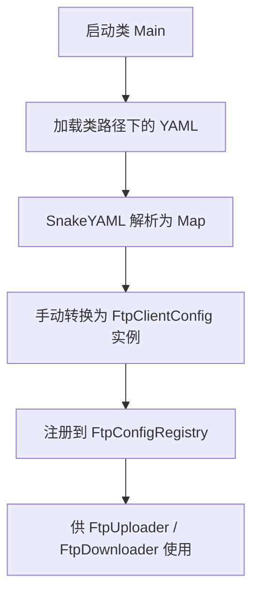

# yaml解析工具

### Java中 YAML 解析工具对比与最佳实践

在 Java 中，常见的 YAML 解析工具主要有以下几种：

| 工具               | 优势                         | 劣势                          | 适用场景                       |
| ---------------- | -------------------------- | --------------------------- | -------------------------- |
| SnakeYAML        | 最主流、轻量级、支持标准 YAML 1.1，文档丰富 | YAML 1.2 支持不完善，类型推断粗糙       | 99% 通用 YAML 加载解析场景         |
| Jackson + YAML   | 基于 Jackson 数据绑定，支持对象映射、序列化 | 依赖多，复杂度略高，默认只支持 YAML 1.0 结构 | 与 JSON 同源系统、Spring Boot 内部 |
| snakeyaml-engine | SnakeYAML 的升级版，支持 YAML 1.2 | API 不兼容 SnakeYAML，社区使用少     | 需支持 YAML 1.2 标准的新项目        |

---

### 1. SnakeYAML（最推荐）

#### Maven依赖

```xml
<dependency>
  <groupId>org.yaml</groupId>
  <artifactId>snakeyaml</artifactId>
  <version>1.33</version>  <!-- Java 8 兼容版本 -->
</dependency>
```

#### 用法示例（Map方式）

```java
InputStream input = new FileInputStream("config.yaml");
Yaml yaml = new Yaml();
Map<String, Object> data = yaml.load(input);
```

#### 用法示例（绑定 Java 对象）

```java
public class AppConfig {
    private String name;
    private Map<String, String> ftp;
    // getter/setter
}

InputStream input = new FileInputStream("config.yaml");
Yaml yaml = new Yaml(new Constructor(AppConfig.class));
AppConfig config = yaml.load(input);
```

#### 特点

* 默认支持 YAML → Map；
* 可结合 `Constructor` 实现对象映射；
* 支持 `Map<String, Map<String, Object>>` 等嵌套结构；
* 兼容 Spring Boot 外部配置加载的 YAML 文件格式。

---

### 2. Jackson + YAML（适用于复杂对象绑定）

#### Maven依赖

```xml
<dependency>
  <groupId>com.fasterxml.jackson.dataformat</groupId>
  <artifactId>jackson-dataformat-yaml</artifactId>
  <version>2.15.3</version>
</dependency>
```

#### 用法示例

```java
ObjectMapper mapper = new ObjectMapper(new YAMLFactory());
AppConfig config = mapper.readValue(new File("config.yaml"), AppConfig.class);
```

#### 特点

* 支持和 JSON 一样的对象绑定；
* 不支持注释和部分 YAML 特性；
* 不支持原始 `Map<String, Object>` 结构解析（更适合强类型配置）；
* 使用上与 JSON 几乎无差异，适合 Jackson 体系项目。

---

### 3. snakeyaml-engine（YAML 1.2）

#### Maven依赖

```xml
<dependency>
  <groupId>org.snakeyaml</groupId>
  <artifactId>snakeyaml-engine</artifactId>
  <version>2.7</version>
</dependency>
```

#### 用法示例

```java
LoadSettings settings = LoadSettings.builder().build();
Yaml yaml = new Yaml(settings);
YamlInputStreamReader input = new YamlInputStreamReader(new FileInputStream("config.yaml"));
Node node = yaml.compose(input);
```

#### 特点

* 更严格支持 YAML 1.2 标准；
* 接口不兼容老版本；
* 不推荐一般项目使用，除非有特定 YAML 1.2 特性需求。

---

### 最佳实践总结

| 维度            | 建议                                        |
| ------------- | ----------------------------------------- |
| 默认 YAML 解析    | <b><u>SnakeYAML</u></b>                   |
| 与 Jackson 配合  | Jackson + YAML，适用于 JSON 兼容体系              |
| 需要严格 YAML 1.2 | snakeyaml-engine                          |
| 推荐结构加载方式      | YAML → `Map<String, Object>` 解析，再映射       |
| 类路径文件读取       | 使用 `ClassLoader.getResourceAsStream(...)` |
| 失败容错处理        | 显式处理 `null`、类型转换失败、缺字段等                   |
| 只加载一次         | 应在启动入口统一调用加载并注册配置                         |

---

### 典型使用场景图示



---

是否需要我提供：

* SnakeYAML + 注释 YAML 文件读取样例
* YAML 加载成嵌套 `Map` 后，自动映射为多个 Java 对象的工具函数
* 支持 reload/监听 YAML 热加载工具封装

如需，可继续补充。
