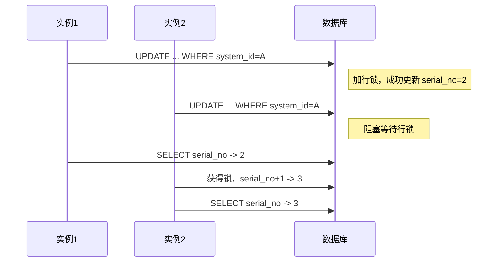

# 需求


- 定时任务, 每次执行定时任务时, 生成一个序号, 从001开始, 每执行一次+1; 每天重置为001
- 多线程环境安全（如并发触发定时任务）
- 边界情况（如重启、跨天、高并发）健壮处理
# 文件持久化版
- com.st.modules.serialNumber.PersistentFileSerialNumberGenerator

# 数据库持久化版

<u><span style="font-weight:bold; color:red;">方案：基于 PostgreSQL 持久化全局单例序号生成器</span></u>

---

### <u>核心设计思路</u>

* 数据表保存\_\_当天日期\_\_和\_\_序号\_\_，每次发号先取出最新序号并+1，跨天自动重置为1
* <u>保证高并发下自增唯一性</u>（采用`FOR UPDATE`悲观锁/原子SQL更新/乐观锁CAS任选）
* 支持Spring项目全局单例（可注入Service/Component）
* <u>适合分布式多实例</u>：所有服务实例都读写同一表，保证全局唯一

---

### <u>1. 数据库表设计</u>

```sql
CREATE TABLE sys_daily_serial (
    biz_type     VARCHAR(64) PRIMARY KEY,  -- 可支持多业务线，如‘VOUCHER’、‘INVOICE’，如不需要多类型可写死一行
    day          DATE NOT NULL,
    serial_no    INTEGER NOT NULL
);
-- 初始化：如只需一类，插入一行
INSERT INTO sys_daily_serial (biz_type, day, serial_no) VALUES ('VOUCHER', CURRENT_DATE, 0)
    ON CONFLICT (biz_type) DO NOTHING;
```

---

### <u>2. Java 实现（Spring Data JdbcTemplate 版）</u>

#### <u>2.1. 核心Service类</u>

```java
import org.springframework.jdbc.core.JdbcTemplate;
import org.springframework.jdbc.support.rowset.SqlRowSet;
import org.springframework.stereotype.Component;
import org.springframework.transaction.annotation.Transactional;

import java.time.LocalDate;

@Component
public class DailySerialDbGenerator {

    private final JdbcTemplate jdbcTemplate;
    private static final String BIZ_TYPE = "VOUCHER"; // 可支持多业务类型扩展

    public DailySerialDbGenerator(JdbcTemplate jdbcTemplate) {
        this.jdbcTemplate = jdbcTemplate;
    }

    /**
     * 获取当天的下一个序号，跨天自动归1，全局唯一，线程安全
     */
    @Transactional
    public String nextSerial() {
        LocalDate today = LocalDate.now();

        // 乐观锁方案：单条UPDATE + 判断受影响行数；也可用悲观锁for update，见下方补充
        int updated = jdbcTemplate.update(
            "UPDATE sys_daily_serial " +
            "SET serial_no = CASE WHEN day = ? THEN serial_no + 1 ELSE 1 END, day = ? " +
            "WHERE biz_type = ?",
            today, today, BIZ_TYPE);

        if (updated == 0) { // 首次插入
            jdbcTemplate.update(
                "INSERT INTO sys_daily_serial (biz_type, day, serial_no) VALUES (?, ?, 1) " +
                "ON CONFLICT (biz_type) DO UPDATE SET day = EXCLUDED.day, serial_no = 1",
                BIZ_TYPE, today);
        }

        // 再查一次最新序号
        SqlRowSet rs = jdbcTemplate.queryForRowSet(
                "SELECT serial_no FROM sys_daily_serial WHERE biz_type = ?", BIZ_TYPE);
        int serial = 1;
        if (rs.next()) {
            serial = rs.getInt(1);
        }
        return String.format("%03d", serial); // "001"~"999"
    }
}
```

---

#### <u>2.2. **说明与关键点**</u>

* <u>并发安全</u>：单条`UPDATE`保证原子性，数据库本身提供行级锁（推荐PostgreSQL/Oracle/MySQL等标准SQL）。
* <u>跨天自动归1</u>：判断day字段与今天是否相同，不同则重置。
* <u>主键唯一</u>：多业务线可用`biz_type`区分，如只需一种类型可忽略该字段。
* <u>分布式可用</u>：所有实例共享数据库，无需本地状态。

---

#### <u>2.3. **悲观锁for update 版本**（并发极高/序号极严格场景）</u>

```java
@Transactional
public String nextSerialWithLock() {
    LocalDate today = LocalDate.now();
    // 查询并加锁
    SqlRowSet rs = jdbcTemplate.queryForRowSet(
        "SELECT day, serial_no FROM sys_daily_serial WHERE biz_type = ? FOR UPDATE", BIZ_TYPE);
    int serial = 1;
    if (rs.next()) {
        LocalDate lastDay = rs.getDate("day").toLocalDate();
        int lastSerial = rs.getInt("serial_no");
        if (today.equals(lastDay)) {
            serial = lastSerial + 1;
        }
        // else, serial=1
        jdbcTemplate.update(
            "UPDATE sys_daily_serial SET day=?, serial_no=? WHERE biz_type=?",
            today, serial, BIZ_TYPE);
    } else {
        jdbcTemplate.update(
            "INSERT INTO sys_daily_serial (biz_type, day, serial_no) VALUES (?, ?, ?)",
            BIZ_TYPE, today, serial);
    }
    return String.format("%03d", serial);
}
```

---

### <u>3. 单元测试示例</u>

```java
@Autowired
DailySerialDbGenerator generator;

@Test
public void testSerial() {
    String sn1 = generator.nextSerial();
    String sn2 = generator.nextSerial();
    System.out.println(sn1 + " " + sn2); // 001 002
}
```

---

### <u>结论</u>

<u><span style="font-weight:bold; color:red;">此方案适合实际生产，支持高并发、分布式部署，序号重启后连续，线程/事务安全。数据库落盘，可靠性强。</span></u>

如需扩展到分布式多业务线，表结构和service方法稍作调整即可。

如果你有特殊高并发或分库分表场景，也可升级为 Redis 方案，随时可补充。


# 支持不同模块, 独立编号

### Java开发中：**每日按系统独立递增序号生成器，持久化到MySQL数据库**（可Spring单例）

#### 设计要点

* **每个系统每天序号独立，隔天自动归零。**
* **所有递增、重置操作必须保证线程安全和高并发正确性（推荐数据库自增、唯一键、事务/乐观锁）。**
* **可直接扩展为Spring Bean，全局单例。**

---

## **一、表结构设计**(mysql)

```sql
CREATE TABLE sys_daily_serial (
  id            BIGINT PRIMARY KEY AUTO_INCREMENT,
  system_id     VARCHAR(64) NOT NULL,
  serial_date   DATE NOT NULL,
  serial_no     INT NOT NULL,
  updated_time  DATETIME NOT NULL DEFAULT CURRENT_TIMESTAMP ON UPDATE CURRENT_TIMESTAMP,
  UNIQUE KEY uq_system_date (system_id, serial_date)
);
```

* `system_id`: 系统标识（如 AP/AR/xxx）。
* `serial_date`: 日期，格式 YYYY-MM-DD。
* `serial_no`: 当天序号（1\~999）。
* `UNIQUE (system_id, serial_date)`: 保证同一系统同一天只有一条记录。

## 表结构设计(pgsql)

下面是将你提供的 MySQL 表结构转换为 **PostgreSQL**（`PostgresSQL 15+`）的标准建表语句版本：

### ### PostgreSQL 建表语句

```sql
DROP TABLE IF EXISTS sys_daily_serial;

CREATE TABLE sys_daily_serial (
  id BIGSERIAL PRIMARY KEY,
  system_id VARCHAR(64) NOT NULL,
  serial_date DATE NOT NULL,
  serial_no INTEGER NOT NULL,
  updated_time TIMESTAMP NOT NULL DEFAULT CURRENT_TIMESTAMP,
  CONSTRAINT uq_system_date UNIQUE (system_id, serial_date)
);
```

------

### ### 说明

| MySQL 元素                                              | PostgreSQL 替代写法                                     |
| ------------------------------------------------------- | ------------------------------------------------------- |
| `BIGINT PRIMARY KEY AUTO_INCREMENT`                     | `BIGSERIAL PRIMARY KEY`（自动递增）                     |
| `DATETIME`                                              | `TIMESTAMP`（无时区，PostgreSQL 中常用时间类型）        |
| `DEFAULT CURRENT_TIMESTAMP ON UPDATE CURRENT_TIMESTAMP` | PostgreSQL 不支持原生 `ON UPDATE`，需通过触发器实现更新 |
| `UNIQUE KEY uq_system_date`                             | `CONSTRAINT uq_system_date UNIQUE` 等效写法             |

------

### ### 如需模拟 MySQL 的 `ON UPDATE CURRENT_TIMESTAMP`

PostgreSQL 不支持 `ON UPDATE CURRENT_TIMESTAMP`，可使用如下触发器模拟：

```sql
CREATE OR REPLACE FUNCTION update_updated_time()
RETURNS TRIGGER AS $$
BEGIN
  NEW.updated_time = CURRENT_TIMESTAMP;
  RETURN NEW;
END;
$$ LANGUAGE plpgsql;

CREATE TRIGGER trigger_updated_time
BEFORE UPDATE ON sys_daily_serial
FOR EACH ROW
EXECUTE FUNCTION update_updated_time();
```

这样，每次更新 `sys_daily_serial` 表记录时，`updated_time` 字段将自动更新时间。

------

是否需要一并提供 PostgreSQL + JPA 或 MyBatis 映射配置？

---

## **二、工具类实现**（推荐Spring/事务/高并发下自增）

依赖：`spring-boot-starter-jdbc` 或 MyBatis、JPA，示例用最基础的 JDBC。

```java
import java.sql.*;
import java.time.LocalDate;
import java.util.Objects;

/**
 * 每个系统每天独立递增编号，持久化MySQL
 */
public class MySQLSerialNumberManager {
    private final String jdbcUrl;
    private final String jdbcUser;
    private final String jdbcPwd;

    // 数据源可用 HikariCP 或 DataSource，示例直连
    public MySQLSerialNumberManager(String jdbcUrl, String user, String pwd) {
        this.jdbcUrl = jdbcUrl;
        this.jdbcUser = user;
        this.jdbcPwd = pwd;
    }

    /**
     * 获取下一个序号，每天重置，超过999抛异常
     * @param systemId 系统标识
     * @return "001"~"999"
     */
    public String nextSerial(String systemId) throws Exception {
        LocalDate today = LocalDate.now();
        try (Connection conn = DriverManager.getConnection(jdbcUrl, jdbcUser, jdbcPwd)) {
            conn.setAutoCommit(false); // 开启事务

            // 步骤1: 尝试更新
            String updateSql =
                    "UPDATE sys_daily_serial SET serial_no = serial_no + 1, updated_time = NOW() " +
                    "WHERE system_id = ? AND serial_date = ? AND serial_no < 999";
            try (PreparedStatement updateStmt = conn.prepareStatement(updateSql)) {
                updateStmt.setString(1, systemId);
                updateStmt.setDate(2, Date.valueOf(today));
                int updated = updateStmt.executeUpdate();
                if (updated > 0) {
                    // 更新成功，查询新值
                    String query = "SELECT serial_no FROM sys_daily_serial WHERE system_id=? AND serial_date=?";
                    try (PreparedStatement qStmt = conn.prepareStatement(query)) {
                        qStmt.setString(1, systemId);
                        qStmt.setDate(2, Date.valueOf(today));
                        try (ResultSet rs = qStmt.executeQuery()) {
                            if (rs.next()) {
                                conn.commit();
                                return String.format("%03d", rs.getInt(1));
                            }
                        }
                    }
                }
            }

            // 步骤2: 插入新记录（今天第一条/不存在则insert）
            String insertSql = "INSERT INTO sys_daily_serial(system_id, serial_date, serial_no, updated_time) VALUES(?,?,1,NOW())";
            try (PreparedStatement insertStmt = conn.prepareStatement(insertSql)) {
                insertStmt.setString(1, systemId);
                insertStmt.setDate(2, Date.valueOf(today));
                insertStmt.executeUpdate();
                conn.commit();
                return "001";
            } catch (SQLException e) {
                // 并发下唯一键冲突（说明已有同日记录），回退重新递增
                conn.rollback();
                return nextSerial(systemId); // 递归重试
            }
        }
    }
}
```

---

## **三、使用示例**

```java
public static void main(String[] args) throws Exception {
    String url = "jdbc:mysql://localhost:3306/yourdb?useSSL=false&characterEncoding=utf8";
    String user = "root";
    String pwd = "xxxx";
    MySQLSerialNumberManager gen = new MySQLSerialNumberManager(url, user, pwd);

    System.out.println(gen.nextSerial("AP"));
    System.out.println(gen.nextSerial("AR"));
    System.out.println(gen.nextSerial("AP"));
}
```

---

## **四、关键说明与边界**

* **线程安全**：靠数据库唯一约束和原子性。并发下多实例无冲突。
* **隔天重置**：日期作为唯一键，每天一条。
* **重启无影响**：数据在DB，服务重启自动连续。
* **递增到999后**：超过抛异常或自定义逻辑。
* **高并发**：DB处理唯一性，实际场景用连接池和DAO/JPA/MyBatis/事务管理。

---

## **五、单元测试建议**

* 并发测试：多线程、跨多系统、跨天场景。
* 边界测试：999上限、并发首条写入、重复insert等。

---

**如需Spring版可直接封装为@Bean + @Transactional，使用JdbcTemplate或MyBatis注入。**
如需支持更多参数（如租户、业务维度）可自行扩展表结构。

# 优化

## 优化点

进行优化: 

- 1, 将sys_daily_serial封装成对应的entity; 
- 2, 数据库connection、及事务, 已经有basedao工具类自动处理, 因此不需要考虑connection及事务处理. 
- 3, 对于返回的序列号, 不再限制大小: 如果是0-99, 则左边补零, 保证三位; 如果>=100, 则原样返回; 

基于你的要求，我们将对原始代码进行结构化重构，具体包括：

1. 将 `sys_daily_serial` 封装为独立的实体类 `SysDailySerial`
2. 移除显式 `Connection`/事务管理逻辑，改为调用已有 `BaseDao` 工具类处理
3. 序列号格式调整：小于 100 的补齐至三位，大于等于 100 的直接返回，不限制上限

------

##  实体类 `SysDailySerial`

```java
import java.time.LocalDateTime;
import java.time.LocalDate;

public class SysDailySerial {
    private Long id;
    private String systemId;
    private LocalDate serialDate;
    private Integer serialNo;
    private LocalDateTime updatedTime;

    // Getter / Setter
    public Long getId() { return id; }
    public void setId(Long id) { this.id = id; }

    public String getSystemId() { return systemId; }
    public void setSystemId(String systemId) { this.systemId = systemId; }

    public LocalDate getSerialDate() { return serialDate; }
    public void setSerialDate(LocalDate serialDate) { this.serialDate = serialDate; }

    public Integer getSerialNo() { return serialNo; }
    public void setSerialNo(Integer serialNo) { this.serialNo = serialNo; }

    public LocalDateTime getUpdatedTime() { return updatedTime; }
    public void setUpdatedTime(LocalDateTime updatedTime) { this.updatedTime = updatedTime; }
}
```

------

## 工具类 `MySQLSerialNumberManager`（简化后）

```java
import java.sql.*;
import java.time.LocalDate;

public class MySQLSerialNumberManager {

    /**
     * 获取下一个序列号（每天独立编号），0~99 左补零，>=100 原样返回
     */
    public String nextSerial(String systemId) throws Exception {
        LocalDate today = LocalDate.now();

        // 步骤1: 更新序号 +1
        int updated = BaseDao.update(
            "UPDATE sys_daily_serial SET serial_no = serial_no + 1, updated_time = NOW() " +
            "WHERE system_id = ? AND serial_date = ?",
            systemId, Date.valueOf(today)
        );

        if (updated > 0) {
            // 查询更新后的值
            SysDailySerial record = BaseDao.queryOne(
                "SELECT serial_no FROM sys_daily_serial WHERE system_id = ? AND serial_date = ?",
                rs -> {
                    SysDailySerial s = new SysDailySerial();
                    s.setSerialNo(rs.getInt("serial_no"));
                    return s;
                },
                systemId, Date.valueOf(today)
            );
            return formatSerial(record.getSerialNo());
        }

        // 步骤2: 插入第一条记录（不存在则新增）
        try {
            BaseDao.update(
                "INSERT INTO sys_daily_serial(system_id, serial_date, serial_no, updated_time) VALUES(?,?,1,NOW())",
                systemId, Date.valueOf(today)
            );
            return "001";
        } catch (SQLException e) {
            // 唯一键冲突：说明已经被别的线程插入，回退重试
            return nextSerial(systemId);
        }
    }

    private String formatSerial(int serial) {
        return serial < 100 ? String.format("%03d", serial) : String.valueOf(serial);
    }
}
```

------

## 补充说明

| 优化点                  | 说明                                                         |
| ----------------------- | ------------------------------------------------------------ |
| 封装 Entity             | `SysDailySerial` 表结构映射清晰、便于后期维护与扩展          |
| 去除 JDBC 连接/事务处理 | 假设已有 `BaseDao` 封装了连接池与事务控制（如 Spring JdbcTemplate） |
| 序列号格式化优化        | 低于 100 补齐 `0`，否则原样返回（`001`~`099` → `100+`）      |
| 递归重试逻辑保留        | 并发安全性通过唯一约束+回退重试保证                          |

------

## `BaseDao` 方法签名（假设）

仅供参考，实际请结合你已有封装使用：

```java
public class BaseDao {
    public static int update(String sql, Object... params) throws SQLException { /* ... */ }

    public static <T> T queryOne(String sql, ResultSetMapper<T> mapper, Object... params) throws SQLException { /* ... */ }

    public interface ResultSetMapper<T> {
        T map(ResultSet rs) throws SQLException;
    }
}
```

------

如需进一步支持分页、多系统分库、Redis缓存加速等，可在此基础上再行扩展。是否需要我为你补上单元测试样例或基于 Spring 的完整版本？

## 安全说明: 并发下多实例无冲突

靠数据库唯一约束和原子性。并发下多实例无冲突

上述 `MySQLSerialNumberManager` 实现的 **核心并发控制机制** 是依赖**数据库层的原子操作和唯一约束**来保证在__多线程、甚至多实例（多服务节点）并发环境下__，序列号不冲突。

### 并发安全性分析

#### 核心策略：两步法 + 乐观插入重试

```java
1. UPDATE ... WHERE system_id = ? AND serial_date = ?
2. IF updated == 0:
       try INSERT (初始 serial_no = 1)
       catch duplicate_key_exception -> 递归重试 nextSerial()
```

------

### 具体保障机制

#### ① 依赖数据库 UPDATE 的原子性

```sql
UPDATE sys_daily_serial
SET serial_no = serial_no + 1
WHERE system_id = ? AND serial_date = ?
```

- 在数据库内部，这是一条**原子操作**：**行锁**保护下完成加一。
- 假如两个线程同时发出请求，只有一个线程能成功更新，另一个要等待行锁释放。
- 这条语句返回 `updated > 0`，说明已经有该记录且加一成功。

#### ② 如果没有记录：依赖唯一键冲突回退重试

```sql
INSERT INTO sys_daily_serial(system_id, serial_date, serial_no, updated_time)
VALUES (?, ?, 1, NOW())
```

- 表上有唯一键约束：

  ```sql
  UNIQUE KEY uq_system_date (system_id, serial_date)
  ```

- 若两个线程同时发现没有记录，同时走 INSERT：

  - 只有一个插入成功
  - 另一个会抛出 `SQLIntegrityConstraintViolationException`

- 捕获异常后**递归调用 `nextSerial()` 重试**

#### ③ 保证多实例安全（跨进程、跨服务器）

该策略不依赖 JVM 内部状态或线程同步，**全部通过数据库完成并发控制**：

- 多实例部署时，只要访问的是同一数据库，就共享同一张表和唯一键约束。
- 数据库天然具备事务和行级锁，因此可保证多个实例并发访问时不冲突。

------

### 为什么这样做是正确的？

关键点：并发安全由数据库的**行级锁 + 唯一键约束**保证，不靠 JVM 同步

- 第一步 `UPDATE` 是并发安全的加一
- 第二步 `INSERT` 如果发生竞争，由唯一键保证互斥性
- 发生冲突时，通过捕获异常 + 重试实现回退

------

### 可选优化建议

#### ① 避免递归造成栈溢出（极端并发下）

```java
// 建议将递归改为循环重试，避免递归栈溢出
public String nextSerial(String systemId) throws Exception {
    while (true) {
        LocalDate today = LocalDate.now();
        int updated = BaseDao.update(...);
        if (updated > 0) {
            ...
            return formatSerial(...);
        }

        try {
            BaseDao.update(... insert ...);
            return "001";
        } catch (SQLException e) {
            // 如果不是唯一键冲突，抛出异常
            if (!isDuplicateKeyException(e)) throw e;
        }
    }
}
```

#### ② 增加最大重试次数或退避时间（避免死循环）

------

如需，我可以附上整个表结构 + 多线程模拟测试 + 事务隔离级别说明，是否继续？

## 安全说明: 并发下多实例无冲突/集群模式下

在你的代码中，即使**没有使用分布式锁**，在**多实例并发（集群模式）下**仍然能保证**生成的序列号唯一且递增**，是因为依赖了__数据库本身的并发控制机制__。下面详细解释其工作原理。

------

### 并发安全性保证来源：数据库级“行锁 + 唯一约束”机制

#### 数据结构核心：唯一约束

```sql
UNIQUE KEY uq_system_date (system_id, serial_date)
```

这条约束确保了 `(system_id, serial_date)` 的组合在表中**最多只能存在一条记录**。

------

### 核心操作流程回顾

#### 场景一：记录已存在时

多个请求并发执行这句 SQL：

```sql
UPDATE sys_daily_serial 
SET serial_no = serial_no + 1 
WHERE system_id = ? AND serial_date = ?
```

**数据库会对匹配到的那一行加行级锁（Row Lock）**，确保同一时刻只有一个线程能执行加一操作，其他线程必须等待锁释放。

- 即使是多个服务实例，访问的是同一个数据库，数据库也能通过行锁串行化对这一行的写操作。
- 这个操作是原子的：`serial_no = serial_no + 1` 不可能被中断或抢占。

#### 场景二：记录尚不存在时

多个线程都尝试执行：

```sql
INSERT INTO sys_daily_serial(system_id, serial_date, serial_no) VALUES (?, ?, 1)
```

此时：

- 只有第一个提交的线程插入成功
- 后续线程插入会触发唯一键冲突（`DuplicateKeyException`）
- 程序捕获异常后重试，再次进入 `UPDATE` 流程

------

### 为什么不需要分布式锁？

因为 MySQL 或 PostgreSQL 本身提供的事务隔离级别 + 行级锁 + 唯一约束，已经天然具备分布式锁的效果，特别体现在以下两方面：

| 功能                 | 由数据库保障的机制                                     |
| -------------------- | ------------------------------------------------------ |
| 多线程顺序递增不重复 | 行锁 + `serial_no = serial_no + 1` 原子操作            |
| 并发插入时不重复     | 唯一键冲突 (`INSERT ...`) + 异常捕获回退重试           |
| 多实例同时操作一致   | 数据库是全局共享资源，锁粒度为行级，天然支持分布式并发 |

------

### 多实例访问时流程时序图（简化）



------

### 总结：即使没有分布式锁，为什么仍能唯一、递增？

1. **更新操作依赖行级锁**，天然串行执行，无需额外分布式控制
2. **插入操作依赖唯一约束**，确保“只有一个线程能成功插入”
3. **失败后 retry（回退）**，重试仍会走 UPDATE 分支，确保递增正确

------

如你后续希望**彻底避免递归 / 异常控制流**，或想将其进一步优化为**MySQL事务内原子获取**，也可考虑如下方式：

- `UPDATE ... RETURNING serial_no`（PostgreSQL 支持）
- `SELECT ... FOR UPDATE` 显式加锁方式（但代码结构更复杂）

如需这些优化示例，我可以继续提供。是否继续？

## 安全说明: 并发下多实例无冲突 vs. 对比秒杀超卖

如果仅靠数据库, 那为何在秒杀活动中, 库存的更新会出现超卖等情况呢? 

这是一个__非常关键__的问题，也涉及到很多系统设计的误区。我们来深入分析：

### 你提出的现象：

> **既然数据库更新是原子的、能加锁，为何秒杀系统中仍然出现“超卖”？**

------

### 回答核心：**数据库行锁能防止并发写，但不能防止**：

① 超卖前查询库存的并发读取
 ② 不同系统/线程对库存的“非原子”扣减
 ③ 请求入库排队之前，库存早已售空

------

### 一、数据库为何能防止冲突，但仍会“超卖”？

假设以下典型 SQL 扣减库存语句：

```sql
UPDATE product SET stock = stock - 1 WHERE id = ? AND stock > 0;
```

看似安全，实际上：

#### 1. 若直接执行 UPDATE，每条语句是原子的，**单条语句不会超卖**

但问题是：

- 秒杀场景下，**大量请求并发到达**，甚至每秒上万
- 数据库级的**行锁是串行执行的**，但在高并发下仍可能：
  - 在应用层看到“还有库存”
  - 多个线程/请求并发认为“可以买”
  - 然后一部分执行成功，一部分失败（stock < 0），但业务层没处理好这部分异常，就会出现数据不一致或**“看起来买到了，但后来回滚”**的问题

#### 2. 如果在应用层先查库存，再执行更新，必然导致“超卖”

**错误做法**：

```java
int stock = query("SELECT stock FROM product WHERE id = 1");
if (stock > 0) {
    update("UPDATE product SET stock = stock - 1 WHERE id = 1");
}
```

- 线程A和线程B同时查库存都是10
- 同时进入 `if (stock > 0)`
- 同时执行 UPDATE → stock 被扣了两次 → **超卖**

------

### 二、真正导致超卖的不是“SQL不安全”，而是“架构层面设计缺陷”

#### 本质问题：数据库并不是为**高并发写冲突控制**设计的

| 问题层面                   | 说明                                                         |
| -------------------------- | ------------------------------------------------------------ |
| 数据库写是原子的           | `UPDATE stock = stock - 1 WHERE stock > 0` 在 MySQL 是安全的，不会出现 -1 |
| 数据库行锁是串行的         | 但高并发写时 TPS 很低，无法支撑秒杀级别并发（万级 QPS）      |
| 应用层并发读取不加锁       | 多线程并发读写引发数据竞争                                   |
| 无缓存削峰机制             | 所有请求打到数据库，瞬间崩溃或产生异常                       |
| 异常回滚或业务流程控制不当 | 扣减失败却没有正确提示或补偿                                 |

------

### 三、秒杀系统正确防超卖方案（核心）

| 技术方案                    | 作用                                                 |
| --------------------------- | ---------------------------------------------------- |
| **Redis 原子扣减库存**      | 高并发条件下优先在缓存中控制库存，避免请求落到数据库 |
| **消息队列排队削峰**        | 请求入列排队，一个个处理，保护数据库                 |
| **数据库乐观锁 / 原子更新** | 避免应用层控制库存逻辑                               |
| **防重请求 + 限流器**       | 限制用户提交频率与重复请求                           |
| **异步落库**                | 成功用户进入队列，后续异步写入数据库                 |

------

### 四、为什么你的 `nextSerial()` 能用数据库而不超发？

区别在于：你的场景是“有状态的+自增型”的单点访问，而秒杀是“减库存”的并发写

| 特性                  | 生成序号     | 秒杀扣库存             |
| --------------------- | ------------ | ---------------------- |
| 每次只能加一          | 是           | 否（库存可能是减多次） |
| 允许排队              | 是           | 否（用户期望实时响应） |
| 有行锁 + 插入重试机制 | 是           | 否（一般无此保护）     |
| 数据库压力低          | 是（少量写） | 否（海量并发请求）     |

------

### 五、总结

数据库可以防止并发写冲突，但不能防止高并发读取 + 写逻辑不当所造成的“超卖”。

要想真正防超卖，要：

1. 不要应用层先查库存后更新
2. 不要让所有请求直打数据库
3. 使用缓存原子操作（如 Redis + Lua 脚本）
4. 使用 MQ + 异步落库
5. 最终数据库只做幂等落库，避免冲突

如你需要一个完整的“防超卖架构图 + Redis + MQ实现模板”，我可以继续给出。是否继续？
