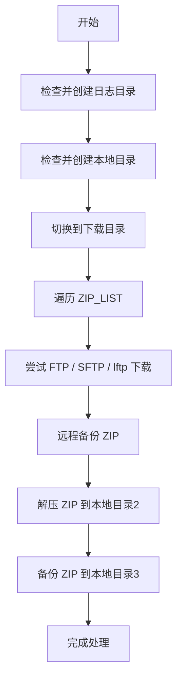

# 注意事项
- sftp, 依赖[[SSH]], 如果没有开启[[ss免密登录]], 执行脚本中, 会要求输入密码. 因此, 开启[[ss免密登录]]最佳, 脚本执行时不需要输入手动输入密码. 
# 需求及功能概述

基本需求及描述
- 从远程指定目录获取特定名称的zip文件放到本地指定目录1
	- 优先使用ftp下载, 如果下载失败, 使用lftp; 如果失败, 先检测是否有sftp命令, 如果有, 则尝试lftp下载
- 然后将拿到的zip文件接到指定目录2, 
- 然后将zip文件移动到指定目录3同时zip添加当天时间戳及.bak进行备份;  
- 然后执行相关命令.  
- 相关账号信息, 及上述目录、文件名放到脚本中作为变量

概述/一: 用于从远程 FTP / SFTP 服务器批量下载指定 zip 文件，支持多种协议自动回退、自动解压、备份本地与远程文件、日志记录、断点续传、并发下载等功能。

概述/二: 该脚本用于通过 FTP/SFTP/lftp 自动从远程服务器获取 ZIP 文件，处理后备份并解压至多个本地目录，具备完整的容错与备份机制，适用于多种自动化部署、数据同步或每日拉取任务场景

# 说明
## 脚本调用方式

```
bash fetch_zip_auto.sh
```

或加入 crontab 定时任务：

```
0 2 * * * /path/to/fetch_zip_auto.sh >> /path/to/fetch.log 2>&1
```

## 主要功能点

| 序号 | 功能                                | 说明                                              |
| ---- | ----------------------------------- | ------------------------------------------------- |
| 1    | 支持 FTP / SFTP / lftp 三种下载方式 | 按优先级自动选择：FTP → SFTP → lftp               |
| 2    | 支持 FTP 被动模式                   | 避免 NAT、防火墙阻塞问题（通过 lftp）             |
| 3    | 自动解压 ZIP 至本地目录2            | 保持最新文件可用性                                |
| 4    | 本地备份 ZIP 文件（添加时间戳）     | 格式：`原名_yyyy-MM-dd-HH-MM-SS.bak`，移动到目录3 |
| 5    | 自动远程备份原始 ZIP 文件           | 支持 FTP、SFTP、lftp 的 `rename` 命令             |
| 6    | 支持批量处理多个 ZIP 文件           | 可配置文件列表，循环处理                          |
| 7    | 自动判断下载是否成功                | 不成功自动切换下载方式                            |
| 8    | 完整日志输出                        | 每一步操作可追踪                                  |
| 9    | 可选后续命令钩子                    | 解压后可触发重启、部署等操作                      |
| 10   | 所有路径/参数均变量化               | 易于维护和多场景复用                              |

补充

| 功能模块         | 描述                                                         |
| ---------------- | ------------------------------------------------------------ |
| 多协议下载       | 按优先级顺序尝试：FTP → SFTP → lftp（若安装）                |
| 文件列表配置     | 通过 `ZIP_LIST` 定义多个 zip 文件名称                        |
| 本地路径管理     | LOCAL_DIR1（下载目录）、LOCAL_DIR2（解压目录）、LOCAL_DIR3（备份目录）自动递归创建 |
| 自动切换工作目录 | 所有操作以 LOCAL_DIR1 为当前工作目录，避免路径混乱           |
| 解压操作         | 下载成功的 zip 文件自动解压到 LOCAL_DIR2                     |
| 本地备份         | 下载的原始 zip 文件移动到 LOCAL_DIR3，并添加时间戳 `.bak` 后缀 |
| 远程备份         | 下载成功后尝试远程重命名 zip 为带时间戳的 `.bak` 文件，防止重复处理 |
| 日志管理         | 所有操作写入按天分文件日志 `${LOG_DIR}/fetch_zip_yyyy-mm-dd-HH-MM-SS.log` |
| 并发与断点续传   | lftp 下载支持 `-n 4 -c` 参数，具备多线程和续传能力           |
| 错误处理         | 每一步都有明确的日志输出，失败退出及时提示                   |

## 详细流程概览



## 配置变量说明

| 变量                                   | 含义                                |
| -------------------------------------- | ----------------------------------- |
| `REMOTE_HOST`                          | 远程服务器地址                      |
| `REMOTE_FTP_PORT` / `REMOTE_SFTP_PORT` | FTP / SFTP 端口                     |
| `REMOTE_USER` / `REMOTE_PASS`          | 登录用户名和密码                    |
| `REMOTE_DIR`                           | 远程 zip 文件所在目录               |
| `ZIP_LIST`                             | zip 文件列表，支持多个文件名        |
| `LOCAL_DIR1/2/3`                       | 本地下载、解压、备份目录            |
| `TODAY`                                | 当前时间，格式：yyyy-MM-dd-HH-MM-SS |
| `LOG_DIR`                              | 日志目录，日志文件自动以时间命名    |

## 使用前提

| 组件          | 要求                      |
| ------------- | ------------------------- |
| Bash          | 任意 Linux / macOS 自带   |
| ftp/sftp/lftp | 至少存在其中一个命令      |
| unzip         | 本地存在 unzip 命令       |
| 日志权限      | 脚本所在目录可写 log 文件 |

## 注意事项/一

- <b><u>远程 ZIP 备份操作不可逆</u></b>，通过 rename 改名，确保不影响后续远程操作
- <b><u>远程需支持 rename 命令</u></b>，FTP/SFTP/lftp均可用
- <b><u>FTP 被动模式</u></b> 仅通过 lftp 设置，标准 ftp 无法控制
- 脚本未做网络重试逻辑，如需高可用可自行添加 `while` 或 `timeout`
- lftp 可断点续传；标准 ftp 与 sftp 无法自动续传 ZIP
- 为避免多文件冲突，请确保所有 zip 文件命名唯一或逻辑上可覆盖
- 请预设本地目录1/2/3 存在，或在脚本前加入 mkdir 检查创建逻辑
## 注意事项/二

1. **权限要求**：脚本执行用户必须具备写入本地目录和运行 ftp/sftp/lftp 的权限。
2. **远程备份依赖权限**：重命名远程文件需要远程账号具备 `rename` 权限。
3. **lftp 是可选依赖**：仅当 `ftp` 和 `sftp` 均失败，才尝试 `lftp`；若未安装会自动跳过。
4. **zip 文件名要求**：不可包含特殊字符，建议英文、数字、小写、中划线。
5. **日志轮转建议**：如长期运行建议使用 `logrotate` 对日志目录进行清理。
6. **断点续传支持**：`sftp` 使用 `get -a`，`lftp` 使用 `pget -c`。
7. **默认采用 FTP 被动模式**：`lftp` 中设置 `ftp:passive-mode on`，`ftp` 默认行为受客户端影响。

## 说明与建议

#### 必须根据环境修改的变量

- `REMOTE_HOST`、`REMOTE_USER`、`REMOTE_PASS`
- `REMOTE_DIR`、`ZIP_FILES`
- `LOCAL_DIR1/2/3` 和 `LOG_DIR`

#### 权限与依赖

- 确保 `ftp`、`sftp`、`lftp`、`unzip` 命令可用
- 脚本运行用户需具备目录读写权限、远程登录权限

#### 增强项可选

- 添加邮件通知失败项
- 增加并发下载
- 文件名格式校验

## 推荐部署方式

- 可加入 `crontab` 定时任务
- 建议封装为可执行脚本 `/usr/local/bin/fetch_zip.sh`
- 建议增加参数化支持（如读取配置文件、接受 CLI 参数）

如需封装成更高级命令行工具（支持参数、配置文件、日志清理等），可进一步扩展为 CLI 工具或系统服务脚本。是否需要输出该版本？

## 可扩展方向

- 服用性: 如需完整脚本代码或特定模块的复用封装，请继续指定。是否需要将所有变量、函数、执行入口封装为模块式结构便于复用
- 解压后校验文件完整性
- 加入 ZIP 内容关键文件是否存在校验
- 增加 ZIP 解压后清理无效文件
- 上传本地处理结果回远程（双向同步）
- 增加邮件告警机制或钉钉/企业微信通知

# 脚本内容

```bash
#!/bin/bash

REMOTE_HOST="example.com"
REMOTE_FTP_PORT=21
REMOTE_SFTP_PORT=22
REMOTE_USER="user"
REMOTE_PASS="password"

REMOTE_DIR="/remote/path"
ZIP_LIST=("file1.zip" "file2.zip" "data_backup.zip")

LOCAL_DIR1="/local/dir1"
LOCAL_DIR2="/local/dir2"
LOCAL_DIR3="/local/dir3"

TODAY=$(date +%Y-%m-%d-%H-%M-%S)

# 日志相关
LOG_DIR="/var/log/fetch_zip"
LOG_FILE="$LOG_DIR/fetch_zip_$TODAY.log"


function log() {
  echo "[$(date '+%Y-%m-%d %H:%M:%S')] $*" | tee -a "$LOG_FILE"
}

function error_exit() {
  log "错误: $*"
  exit 1
}


# ==========================
# 检测目录是否存在; 
# 若目录已存在 → 无操作
# 若目录不存在 → 自动递归创建
# 若创建失败（如权限问题）→ 打印错误并退出
# ==========================
function ensure_local_dirs() {
  for dir in "$LOCAL_DIR1" "$LOCAL_DIR2" "$LOCAL_DIR3"; do
    if [ ! -d "$dir" ]; then
      echo "目录 $dir 不存在，正在创建..."
      mkdir -p "$dir"
      if [ $? -ne 0 ]; then
        echo "创建目录 $dir 失败，请检查权限" >&2
        exit 1
      fi
    fi
  done
}

# ==========================
# 检测目录是否存在; 日志相关目录 
# 若目录已存在 → 无操作
# 若目录不存在 → 自动递归创建
# 若创建失败（如权限问题）→ 打印错误并退出
# ==========================
function ensure_log_dir() {
  if [ ! -d "$LOG_DIR" ]; then
    mkdir -p "$LOG_DIR" || {
      echo "日志目录创建失败: $LOG_DIR"
      exit 1
    }
  fi
}


# ==========================
# 自动切换脚本执行目录到 $LOCAL_DIR1
# cd 到 $LOCAL_DIR1，后续操作默认以此为起点
# 避免路径混乱，确保相对路径行为稳定
# ==========================
function switch_to_download_dir() {
  cd "$LOCAL_DIR1" || {
    echo "切换目录失败：$LOCAL_DIR1 不存在或无法访问"
    exit 1
  }
}

function ftp_download_file() {
  local FILE=$1
  log "FTP 下载 $FILE"
  ftp -inv $REMOTE_HOST <<EOF >> "$LOG_FILE" 2>&1
user $REMOTE_USER $REMOTE_PASS
cd $REMOTE_DIR
lcd $LOCAL_DIR1
get $FILE
bye
EOF
}

function sftp_download_file() {
  local FILE=$1
  log "SFTP 下载 $FILE"
  sftp -P $REMOTE_SFTP_PORT $REMOTE_USER@$REMOTE_HOST <<EOF >> "$LOG_FILE" 2>&1
cd $REMOTE_DIR
lcd $LOCAL_DIR1
get -a $FILE  %% -a 表示断点续传
bye
EOF
}

function lftp_download_file() {
  local FILE=$1
  log "lftp 下载 $FILE（支持断点续传）"
  lftp -u "$REMOTE_USER","$REMOTE_PASS" -p $REMOTE_FTP_PORT $REMOTE_HOST <<EOF >> "$LOG_FILE" 2>&1
set ftp:ssl-allow no
cd $REMOTE_DIR
lcd $LOCAL_DIR1
pget -n 4 -c $FILE  %% -c 表示续传；-n 为并发线程数（视情况调整）
bye
EOF
}


# ==========================
# 备份远程文件
# ==========================
function ftp_remote_backup() {
  local FILE=$1
  local NEW_NAME="${FILE}${BACKUP_SUFFIX}"

  log "FTP 远程备份 $FILE 为 $NEW_NAME"

  ftp -inv $REMOTE_HOST <<EOF >> "$LOG_FILE" 2>&1
user $REMOTE_USER $REMOTE_PASS
cd $REMOTE_DIR
rename $FILE $NEW_NAME
bye
EOF
}

function sftp_remote_backup() {
  local FILE=$1
  local NEW_NAME="${FILE}${BACKUP_SUFFIX}"

  log "SFTP 远程备份 $FILE 为 $NEW_NAME"

  sftp -P $REMOTE_SFTP_PORT $REMOTE_USER@$REMOTE_HOST <<EOF >> "$LOG_FILE" 2>&1
cd $REMOTE_DIR
rename $FILE $NEW_NAME
bye
EOF
}

function lftp_remote_backup() {
  local FILE=$1
  local NEW_NAME="${FILE}${BACKUP_SUFFIX}"

  log "lftp 远程备份 $FILE 为 $NEW_NAME"

  lftp -u "$REMOTE_USER","$REMOTE_PASS" -p $REMOTE_FTP_PORT $REMOTE_HOST <<EOF >> "$LOG_FILE" 2>&1
set ftp:ssl-allow no
set ftp:passive-mode on
cd $REMOTE_DIR
rename $FILE $NEW_NAME
bye
EOF
}


# ==========================
# 处理文件: 检测是否下载成功-》解压-》备份本地文件
# ==========================
function process_file() {
  local FILE=$1
  local BACKUP_NAME="${FILE%.zip}_$TODAY.bak"

  # 判断是否已成功下载
  if [ -f "$LOCAL_DIR1/$FILE" ]; then
    log "文件 $FILE 下载成功，开始解压"
    unzip -o "$LOCAL_DIR1/$FILE" -d "$LOCAL_DIR2" >> "$LOG_FILE" 2>&1 || {
      log "解压 $FILE 失败"
      return
    }

    log "备份 $FILE 为 $BACKUP_NAME"
    mv "$LOCAL_DIR1/$FILE" "$LOCAL_DIR3/$BACKUP_NAME" || {
      log "移动备份失败: $FILE"
    }
  else
    log "文件 $FILE 下载失败，跳过处理"
  fi
}

# ==========================
# 处理文件: 检测是否下载成功; 不成功, 则尝试多种方式下载; 下载成功后, 备份远程
# ==========================
function download_file_with_fallback() {
  local FILE=$1

  ftp_download_file "$FILE"
  if [ -f "$LOCAL_DIR1/$FILE" ]; then
    log "FTP 成功：$FILE"
    ftp_remote_backup "$FILE"
    return
  fi

  log "FTP 失败，尝试 SFTP"
  sftp_download_file "$FILE"
  if [ -f "$LOCAL_DIR1/$FILE" ]; then
    log "SFTP 成功：$FILE"
    sftp_remote_backup "$FILE"
    return
  fi

  if command -v lftp >/dev/null 2>&1; then
    log "SFTP 失败，尝试 lftp"
    lftp_download_file "$FILE"
    if [ -f "$LOCAL_DIR1/$FILE" ]; then
      log "lftp 成功：$FILE"
      lftp_remote_backup "$FILE"
    else
      log "lftp 失败：$FILE"
    fi
  else
    log "SFTP 失败，lftp 不存在，放弃：$FILE"
  fi
}

# 
function main() {
  ensure_log_dir
  ensure_local_dirs
  switch_to_download_dir

  for ZIP in "${ZIP_LIST[@]}"; do
    log ">>>> 正在处理文件：$ZIP"
    download_file_with_fallback "$ZIP"
    process_file "$ZIP"
  done
  log "脚本执行完毕"

 # 其他功能可扩展
}


log "===== 批量下载开始 ====="
main
log "===== 所有文件处理完成 ====="

```